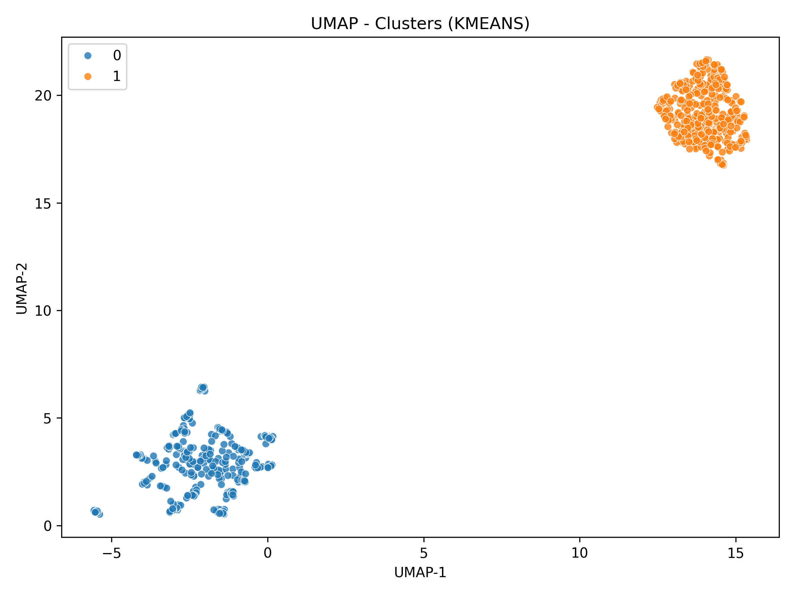
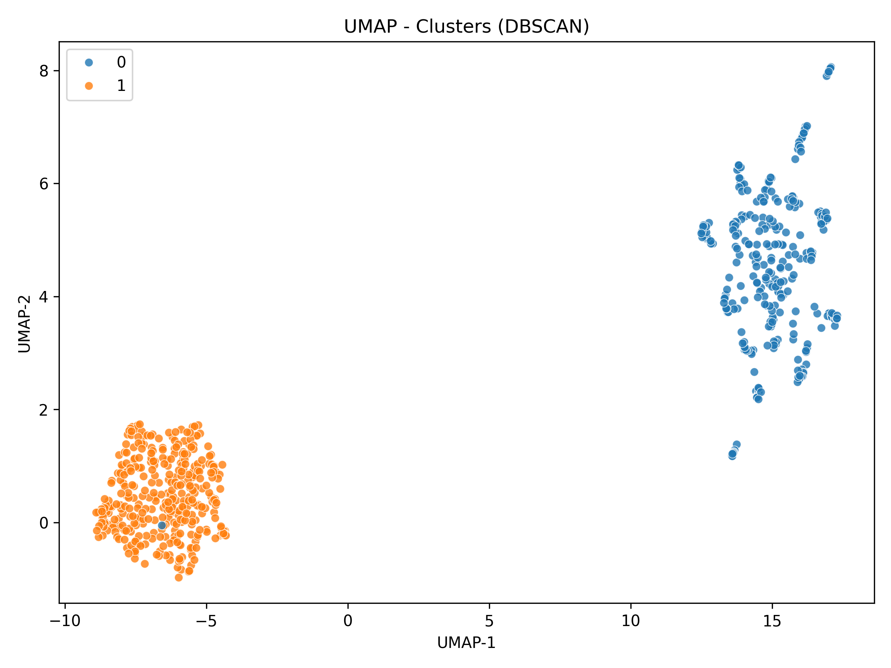
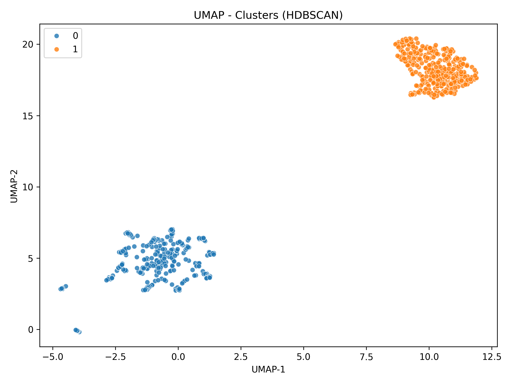

# Exercise 2: Document Clustering of Congressional Debates

## Overview

This project performs clustering analysis on two corpora of parliamentary debates:
- **US Congress Debates**: [`data/US_congress_debates`](data/US_congress_debates)
- **British Parliament Debates**: [`data/british_parliament_debates`](data/british_parliament_debates)

The goal is to apply various clustering algorithms to identify patterns and group documents based on their textual content.

---

## Project Structure

```
.
├── data/                          # Raw debate documents
├── clean_docs/                    # Cleaned documents
├── lemmas/                        # Lemmatized documents
├── vectors/                       # BM25 vectorized representations
│   ├── BM25_clean/
│   └── BM25_lemmas/
├── clusters/                      # Clustering results
│   ├── kmeans/
│   ├── dbscan/
│   ├── hdbscan/
│   └── gmm/
├── s_01_clean_and_lemmatize.py
├── s_02_build_sparse_vectors_tf_bm25.py
├── s_03_clustering_utils.py
├── s_03_k-mean_clustering.py
├── s_03_DBSCAN_clustering.py
├── s_03_HDBSCAN_clustering.py
├── s_03_GMM_clustering.py
├── s_04_evaluate_clustering.py
└── s_05_visualize_clusters.py
```

---

## Usage

Run the pipeline stages sequentially:

```bash
# Stage 1: Preprocessing
python s_01_clean_and_lemmatize.py

# Stage 2: Vectorization
python s_02_build_sparse_vectors_tf_bm25.py

# Stage 3: Clustering
python s_03_k-mean_clustering.py
python s_03_DBSCAN_clustering.py
python s_03_HDBSCAN_clustering.py
python s_03_GMM_clustering.py

# Stage 4: Evaluation
python s_04_evaluate_clustering.py

# Stage 5: Visualization
python s_05_visualize_clusters.py
```

## Pipeline Stages

### Stage 1: Text Preprocessing

Documents are cleaned and lemmatized to prepare them for vectorization.

**Outputs:**
- Cleaned documents: [`clean_docs/`](clean_docs)
- Lemmatized documents: [`lemmas/`](lemmas)

### Stage 2: Vectorization

BM25 sparse vectors are constructed for both corpora using a unified vocabulary. Each document is represented as a vector and assigned a ground truth label (US or UK).

**Outputs:**
- Vocabulary: [`vectors/BM25_clean/vocabulary.json`](vectors/BM25_clean/vocabulary.json)
- BM25 matrix: `vectors/BM25_clean/bm25_okapi.npz`
- Filenames: [`vectors/BM25_clean/filenames.json`](vectors/BM25_clean/filenames.json)
- Ground truth labels: [`vectors/BM25_clean/labels.json`](vectors/BM25_clean/labels.json)

### Stage 3: Clustering

Multiple clustering algorithms are applied to the BM25 lemmatized vectors. Each method generates predicted cluster labels and metadata stored in the `clusters/` directory.

---

## Clustering Methods

### Method 1: MiniBatchKMeans

**Algorithm:** `MiniBatchKMeans` from scikit-learn

MiniBatchKMeans is a scalable variant of K-Means that processes data in mini-batches, making it efficient for large corpora. It iteratively updates cluster centroids based on subsets of the data.

**Vector Normalization:**
- Initially, the model tended to assign all documents to one cluster with the other cluster containing only noise/outliers
- **Solution**: L2-normalization of BM25 vectors before clustering
- **Rationale**: K-Means is sensitive to vector magnitude; longer vectors dominate distance calculations
- Normalization ensures all documents are compared based on direction (content similarity) rather than length
- **Effect**: Even though K-Means uses Euclidean distance, normalization makes it behave like cosine similarity by removing document length effects

**Parameters:**
- `n_clusters = 2` — Target number of clusters (US vs UK)
- `batch_size = 256` — Number of documents per batch
- `max_iter = 100` — Maximum iterations for convergence
- `n_init = 30` — Number of initializations; best result is selected
- `init = "k-means++"` — Smart initialization that spreads initial centroids to improve convergence


**Outputs:**
- Cluster labels: [`clusters/kmeans/cluster_labels.npy`](clusters/kmeans/cluster_labels.npy)
- Metadata: [`clusters/kmeans/clustering_meta.json`](clusters/kmeans/clustering_meta.json)

---

### Method 2: DBSCAN

**Algorithm:** `DBSCAN` from scikit-learn

DBSCAN (Density-Based Spatial Clustering of Applications with Noise) identifies clusters based on density. Unlike K-Means, it doesn't require specifying the number of clusters and can detect outliers as noise points.

**Key Concept:**
- Points with sufficient neighbors within a radius (`eps`) form dense regions (clusters)
- Points in low-density regions are classified as noise

**Parameter Selection:**

*`min_samples = 5`*
- Minimum number of neighbors required for a point to be considered a core point
- Value chosen based on high-dimensional sparse data characteristics (lower values prevent excessive noise classification)

*`eps` (neighborhood radius)*
- Determined automatically using **k-distance heuristic method**:

**K-Distance Heuristic Process:**
1. **Compute Pairwise Distances**: Calculate cosine distance between all document pairs in the BM25 vector space
2. **Find k-Nearest Neighbors**: For each document, identify the k-th nearest neighbor (where k = `min_samples`)
3. **Extract k-Distances**: Record the distance to the k-th neighbor for every document
4. **Apply Quantile Threshold**: Take the 80th percentile of all k-distances as the `eps` value

**Rationale:**
- Documents in dense regions have smaller k-distances (neighbors are close)
- Documents in sparse regions or near cluster boundaries have larger k-distances
- The 80th percentile approximates the "elbow point" in a k-distance plot, separating dense clusters from noise
- This approach avoids manual `eps` tuning by automatically adapting to the data's density distribution

**Noise Handling:**
- Initial noise points (label = -1) are recorded in metadata
- Post-processing step: each noise point is reassigned to its nearest cluster based on cosine distance to cluster centroids
- This ensures all documents receive a cluster assignment while preserving information about original noise classification

**Outputs:**
- Cluster labels: [`clusters/dbscan/cluster_labels.npy`](clusters/dbscan/cluster_labels.npy)
- Metadata: [`clusters/dbscan/clustering_meta.json`](clusters/dbscan/clustering_meta.json)
  - Contains: algorithm parameters, number of clusters found, noise point statistics, heuristic details

---

### Method 3: HDBSCAN

**Algorithm:** `HDBSCAN` from the hdbscan library

HDBSCAN (Hierarchical DBSCAN) extends DBSCAN by varying the density threshold (eps) across different regions. It builds a hierarchy of clusters at different density levels and selects the most stable clusters.

**Key Advantages:**
- Adapts to varying density across the data space
- Automatically determines optimal density thresholds
- No need to specify `eps` manually

**How It Works:**
Unlike DBSCAN which uses a fixed `eps` radius, HDBSCAN:
1. Tests multiple distance thresholds to build a **cluster hierarchy**
2. Identifies clusters that remain stable across different density levels
3. Selects the most persistent clusters from the hierarchy

This approach handles datasets with **varying cluster densities** more effectively than standard DBSCAN.

**Parameter Selection:**

*`min_cluster_size = 30`*
- Minimum number of documents for a valid cluster
- Set to ~3-5% of dataset size to ensure meaningful groupings
- Prevents overly fragmented clustering

*`min_samples = 8`*
- Controls clustering conservativeness (higher values create denser clusters with more noise points)
- Balances between capturing true clusters and avoiding excessive noise classification
- Set to require reasonable local density without being overly strict

*`cluster_selection_method = 'eom'`* (Excess of Mass)
- Selects stable, large clusters from the hierarchy
- Alternative `'leaf'` would produce many small clusters
- EOM is preferred for identifying the two main groups (US vs UK)

**Noise Handling:**
- Points that don't belong to any stable cluster are initially labeled as noise (label = -1)
- Post-processing: noise points are reassigned to their nearest cluster based on cosine distance
- Original noise count is preserved in metadata for analysis

**Outputs:**
- Cluster labels: [`clusters/hdbscan/cluster_labels.npy`](clusters/hdbscan/cluster_labels.npy)
- Metadata: [`clusters/hdbscan/clustering_meta.json`](clusters/hdbscan/clustering_meta.json)
  - Contains: parameters, cluster counts, noise statistics, selection rationale

---

### Method 4: GMM (Gaussian Mixture Model)

**Algorithm:** `GaussianMixture` from scikit-learn

GMM is a probabilistic clustering method that models the data as a mixture of Gaussian distributions. Unlike hard clustering (K-Means), GMM provides soft cluster assignments with probabilities.

**Key Concept:**
- Assumes data is generated from a mixture of Gaussian distributions
- Each cluster is represented by a Gaussian with mean and covariance
- Documents can belong to multiple clusters with different probabilities

**Parameters:**
- `n_components = 2` — Number of Gaussian components (US vs UK)
- `covariance_type = 'tied'` — Shared covariance across clusters (reduces parameters for high-dimensional sparse data)
- `max_iter = 100` — Maximum EM algorithm iterations

**Outputs:**
- Cluster labels: [`clusters/gmm/cluster_labels.npy`](clusters/gmm/cluster_labels.npy)
- Metadata: [`clusters/gmm/clustering_meta.json`](clusters/gmm/clustering_meta.json)

---

## Stage 4: Evaluation

### Evaluation Methodology

Clustering results from Stage 3 are evaluated against ground truth labels (US/UK) from Stage 2 using standard classification metrics.

**Libraries Used:**
- `sklearn.metrics` for computing accuracy, precision, recall, F1-score, and confusion matrices
- `pandas` for organizing results into tabular format
- `openpyxl` (via pandas) for Excel output generation

**Cluster-to-Class Mapping:**
- Each cluster is assigned to a class (US or UK) using **majority vote**
- The class with the most documents in a cluster becomes that cluster's label
- All predicted cluster labels are then mapped to their corresponding class labels

**Evaluation Metrics:**

For each clustering method and each class (US and UK), the following metrics are calculated:

**1. Accuracy**
- Formula: `Accuracy = (TP + TN) / (TP + TN + FP + FN)`
- Measures: Overall proportion of correctly classified documents
- Range: 0 to 1 (higher is better)

**2. Precision**
- Formula: `Precision = TP / (TP + FP)`
- Measures: Of all documents predicted as a certain class, how many actually belong to that class
- Purpose: Prevents false positives — ensures predicted labels are reliable
- Example: If precision for US = 0.85, then 85% of documents predicted as US are truly US documents

**3. Recall**
- Formula: `Recall = TP / (TP + FN)`
- Measures: Of all documents that truly belong to a class, how many were correctly identified
- Purpose: Prevents false negatives — ensures we don't miss documents from the target class
- Example: If recall for UK = 0.78, then 78% of actual UK documents were correctly identified as UK

**4. F1-Score (per class)**
- Formula: `F1 = 2 × (Precision × Recall) / (Precision + Recall)`
- Measures: Harmonic mean of precision and recall
- Purpose: Balances precision and recall into a single metric
- Range: 0 to 1 (higher is better)

**5. F1-Macro (overall)**
- Formula: `F1-Macro = (F1_US + F1_UK) / 2`
- Measures: Average F1-score across both classes
- Purpose: **Prevents class imbalance bias** — treats both classes equally regardless of size
- Example: If we have 90% US documents and 10% UK documents, and a model assigns everything to US, accuracy would be 90% but F1-Macro would be ~0.47, revealing poor performance on the minority class

**Why F1-Macro Matters:**
- Simple accuracy can be misleading with imbalanced datasets
- A naive classifier that always predicts the majority class (e.g., "US") would achieve high accuracy but fail on the minority class (UK)
- F1-Macro ensures both US and UK clusters are evaluated fairly, regardless of dataset composition

**Outputs:**
- Console output: Confusion matrices 
  (rows = true class, columns = predicted class)
, per-class metrics, and summary statistics for each method
- Excel file: [`clusters/cluster_evaluation_results.xlsx`](clusters/cluster_evaluation_results.xlsx)
  - Contains: Method name, number of clusters, accuracy, F1-Macro, and detailed per-class metrics (precision, recall, F1, support) for both US and UK

---

## Stage 5: Visualization

### UMAP Dimensionality Reduction

High-dimensional BM25 vectors (thousands of dimensions) are reduced to 2D space using **UMAP** (Uniform Manifold Approximation and Projection) for visualization. UMAP preserves both local and global structure, making it ideal for visualizing clusters.

**What is UMAP?**
- A dimensionality reduction technique similar to t-SNE but faster and better at preserving global structure
- Maps high-dimensional sparse vectors to 2D while maintaining distances between similar documents
- Uses cosine distance metric (same as clustering algorithms) for consistency

**Visualizations Created:**

1. **Ground Truth Labels** (`umap_true_labels.png`)
   - Shows the true UK vs US separation in 2D space
   - Baseline reference for evaluating clustering quality

2. **Clustering Results** (one plot per method)
   - `umap_kmeans.png` — MiniBatchKMeans cluster assignments
   - `umap_dbscan.png` — DBSCAN clusters (noise points shown as gray crosses)
   - `umap_hdbscan.png` — HDBSCAN clusters (noise points shown as gray crosses)
   - `umap_gmm.png` — GMM cluster assignments

**Interpretation:**
- **Tight, separated clusters**: Indicate clear distinction between US and UK documents
- **Overlapping regions**: Suggest documents with mixed characteristics or ambiguous language
- **Noise points** (DBSCAN/HDBSCAN): Documents that don't fit well into any cluster, shown as gray crosses

**Outputs:**
- All visualizations saved in: [`clusters/visualizations/`](clusters/visualizations/)
- High-resolution PNG files suitable for reports and presentations

---

## Results and Analysis

### Evaluation Summary

The following table summarizes the performance of all three clustering methods:

| Method | Clusters | Accuracy | F1-Macro | UK Precision | UK Recall | US Precision | US Recall |
|--------|----------|----------|----------|--------------|-----------|--------------|-----------|
| **KMeans** | 2    | 1.000    | 1.000    | 1.000        | 1.000     | 1.000        | 1.000 |
| **DBSCAN** | 2    | 0.999    | 0.999    | 0.997        | 1.000     | 1.000        | 0.997 |
| **HDBSCAN** | 2   | 1.000    | 1.000    | 1.000        | 1.000     | 1.000        | 1.000 |

**Dataset Composition:**
- Total documents: 689
- UK documents: 329 (47.8%)
- US documents: 360 (52.2%)
- Balanced dataset (no significant class imbalance)

### Detailed Analysis by Method

#### MiniBatchKMeans


**Performance:**
- **Accuracy: 100%** — Perfect classification of all documents
- **F1-Macro: 1.000** — Excellent performance on both classes
- **UK**: Precision = 1.000, Recall = 1.000 (329/329 correctly identified)
- **US**: Precision = 1.000, Recall = 1.000 (360/360 correctly identified)

**Algorithm Parameters:**
- `n_clusters = 2` — Pre-specified number of clusters
- `batch_size = 256` — Documents processed per iteration
- `max_iter = 100` — Maximum iterations
- `random_state = 42` — For reproducibility

**Analysis:**
MiniBatchKMeans achieved perfect clustering results, successfully separating all UK and US documents into two distinct clusters. The algorithm correctly assigned each document to its true origin without any misclassifications. This exceptional performance indicates that the BM25 lemmatized vectors capture strong linguistic and stylistic differences between British Parliament and US Congress debates.

**Key Insight:** Despite being a simple centroid-based method, K-Means proved highly effective for this binary classification task, benefiting from the clear separation in the high-dimensional BM25 feature space. The mini-batch approach provided computational efficiency while maintaining perfect accuracy.

---

#### DBSCAN


**Performance:**
- **Accuracy: 99.85%** — Near-perfect classification with minimal errors
- **F1-Macro: 0.999** — Balanced performance across both classes
- **UK**: Precision = 0.997, Recall = 1.000 (329/329 identified, 1 false positive)
- **US**: Precision = 1.000, Recall = 0.997 (359/360 correctly identified, 1 missed)

**Algorithm Parameters:**
- `eps = 0.877` — Automatically determined via k-distance heuristic (80th percentile)
- `min_samples = 5` — Minimum neighbors for core points
- `metric = cosine` — Distance measure for BM25 vectors

**Analysis:**
DBSCAN achieved near-perfect results with only 1 misclassification out of 689 documents. The algorithm successfully identified 2 density-based clusters without requiring the number of clusters as input. 

**Noise Handling:**
- **Initial noise points**: 39 documents (5.7% of dataset) were originally classified as noise
- **After reassignment**: All 39 noise points were reassigned to their nearest cluster using cosine distance
- **Final clusters**: Cluster 0 = 330 documents, Cluster 1 = 359 documents

The k-distance heuristic with `eps=0.877` proved slightly conservative, initially marking some boundary documents as noise. However, the post-processing noise reassignment step successfully incorporated these documents into appropriate clusters.

**Misclassification Details:**
- 1 US document was assigned to the UK cluster (false negative for US, false positive for UK)
- This represents a 0.15% error rate

**Key Insight:** The automatic eps selection via k-distance heuristic worked well, though it initially identified some borderline cases as noise. The noise reassignment strategy ensured all documents received cluster assignments while maintaining near-perfect accuracy. The single misclassification likely represents a US document with linguistic features more similar to UK parliamentary language.

---

#### HDBSCAN


**Performance:**
- **Accuracy: 100%** — Perfect classification of all documents
- **F1-Macro: 1.000** — Excellent performance on both classes
- **UK**: Precision = 1.000, Recall = 1.000 (329/329 correctly identified)
- **US**: Precision = 1.000, Recall = 1.000 (360/360 correctly identified)

**Algorithm Parameters:**
- `min_cluster_size = 30` — Minimum documents for valid cluster (~4.4% of dataset)
- `min_samples = 8` — Controls clustering conservativeness
- `cluster_selection_method = eom` — Excess of Mass (stable, large clusters)
- `metric = cosine` — Distance measure for BM25 vectors

**Analysis:**
HDBSCAN achieved flawless clustering results by leveraging its hierarchical density-based approach. The algorithm automatically adapted to varying density levels across the feature space and selected the most stable clusters.

**Noise Handling:**
- **Initial noise points**: 105 documents (15.2% of dataset) were originally classified as noise during hierarchical clustering
- **After reassignment**: All 105 noise points were reassigned to their nearest cluster using cosine distance
- **Final clusters**: Cluster 0 = 329 documents (UK), Cluster 1 = 360 documents (US)

Despite initially identifying a significant number of noise points, HDBSCAN's hierarchical approach combined with the noise reassignment strategy resulted in perfect separation. The final cluster assignments exactly matched the ground truth labels.

**Key Insight:** HDBSCAN's ability to build a cluster hierarchy and select stable clusters via EOM proved highly effective. While the algorithm was conservative in its initial clustering (marking 15% as noise), the hierarchical structure captured the true data organization. The noise reassignment step, guided by cosine distances to cluster centroids, perfectly placed all boundary documents into their correct classes. This demonstrates the robustness of combining hierarchical density analysis with post-processing refinement.

---

### Comparative Analysis

**Overall Rankings (Best to Good):**
1. **KMeans & HDBSCAN (tied)**: 100% accuracy, perfect F1-Macro
2. **DBSCAN**: 99.85% accuracy, 0.999 F1-Macro (1 error)

**Key Findings:**

1. **Excellent Separability**: All three methods achieved ≥99.85% accuracy, indicating that UK and US parliamentary debates have highly distinguishable linguistic features in the BM25 vector space.

2. **Method Comparison**:
   - **KMeans**: Simplest algorithm, perfect results. Required knowing k=2 in advance but achieved flawless separation with no noise points.
   - **DBSCAN**: Nearly perfect with automated cluster discovery. Initially identified 39 noise points (5.7%) which were successfully reassigned. Single misclassification after reassignment suggests one borderline document.
   - **HDBSCAN**: Most sophisticated, perfect results after noise reassignment. Initially marked 105 documents (15.2%) as noise, demonstrating conservative clustering, but the hierarchical approach combined with noise reassignment achieved perfect class separation.

3. **Feature Space Quality**: The near-perfect results across all methods validate the effectiveness of:
   - BM25 weighting for capturing document importance
   - Lemmatization for reducing noise and focusing on root words
   - Cosine distance for measuring semantic similarity in sparse high-dimensional space

4. **No Class Imbalance Issues**: The balanced dataset (47.8% UK, 52.2% US) contributed to reliable performance. F1-Macro effectively captured per-class performance without bias.

5. **Practical Implications**: Any of these three methods would be suitable for automatically classifying parliamentary debate documents by origin, with KMeans offering the best speed-to-accuracy tradeoff and HDBSCAN providing the most robust parameter-free solution.

---

### Visualizations

**UMAP Projections:**
The 2D UMAP visualizations (available in `clusters/visualizations/`) show clear separation between UK and US document clusters across all methods. The tight, non-overlapping clusters in the visualizations confirm the strong separability observed in the quantitative metrics.

**Ground Truth Reference:**


The ground truth visualization demonstrates the inherent separability of the two corpora in the reduced 2D space, which all clustering methods successfully captured.

---


### classification
10 cross validation:
for any method, we part it to 10 folds,
for each fold we run the model on ..% and test on ..%
then compute for each fold metrics like: F1, ...
then save in .. for each model (LoR, svm ...):
excel file with F1 MACRO... mean and of all folds 
for estimation and further comparison between..
using:
... to separate the folds balnced,
so there is no folds like 0 uk and 100% us.
randonlt shuffle the docs and then part.
then compute the runningmmodel on all data 
and save resukts.
find the top 20 features for any class,
by taking the tems with highest weights.

### LoR
logistic regressios.
method:
sigmoid function : ...
where z = w0x0+wx1...
so when z > 0 take it to 1, < 0 to 0.
so we can classify to 2 classes: 1=... 0 =... 
so each term is x
try to find what best w's to minimize the mistake
mistage function (punishment):
...
take 20 terms by:
first class: lowest weights
secod: highest weights.
(lower weights -> moving the polinom to -.. so sigmoid will be 0 and..)
  penalty="l2", # prevent overfitting, keep stable weights pu punishing ....
        solver="liblinear", # binary classification, good for small datasets
        max_iter=1000,
        class_weight=None,  # the clusters are roughly balanced
        is to balance if there are rare cluster so give it more weight...
takes....
  output:....


### ANN Classification (Keras)

**Algorithm:** Feed-forward Artificial Neural Network with Keras/TensorFlow

This stage trains deep learning models to classify each document as UK or US based on its BM25 vector representation. Two variants are trained with different activation functions (ReLU and GELU) to compare performance.

#### 1. Data Preparation

**Input Data:**
- BM25 lemmatized vectors (sparse format from Stage 2)
- Ground truth labels (UK/US)

**Preprocessing Steps:**
1. Convert sparse BM25 matrix to dense float32 arrays (required for Keras)
2. Encode labels as integers: `UK → 0`, `US → 1`
3. Stratified train/validation/test split:
   - **80% training data** (further split into 90% train / 10% validation)
   - **20% test data** (held out for final evaluation)

**Rationale for Stratified Split:**
- Ensures balanced class distribution across all splits
- Prevents training bias toward the majority class
- Maintains dataset proportions in validation/test sets

---

#### 2. ANN Architecture

Both models share the same multi-layer structure:

```
Input Layer (BM25 vector, dim = vocabulary size)
    ↓
Dense(128) + activation         ← Projection layer (dimensionality reduction)
    ↓
Dense(10) + activation          ← Hidden layer 1
    ↓
Dense(10) + activation          ← Hidden layer 2
    ↓
Dense(7) + activation           ← Hidden layer 3
    ↓
Dense(2, softmax)               ← Output layer (UK vs US probabilities)
```

**Layer Details:**
- **Projection layer (Dense 128)**: Reduces high-dimensional BM25 vectors (~thousands of features) to compact representation
- **Hidden layers (10 → 10 → 7)**: Progressively refine feature extraction with decreasing dimensions
- **Output layer (Dense 2, softmax)**: Produces probability distribution over UK/US classes

**Two Activation Function Variants:**

1. **ReLU Model** (`activation='relu'`)
   - ReLU(x) = max(0, x)
   - Fast computation, widely used
   - Addresses vanishing gradient problem
   - Can suffer from "dying ReLU" issue (neurons outputting 0)

2. **GELU Model** (`activation='gelu'`)
   - GELU(x) = x · Φ(x), where Φ is the Gaussian cumulative distribution
   - Smoother activation than ReLU
   - Better gradient flow in deep networks
   - Often used in transformer models (BERT, GPT)

---

#### 3. Training Configuration

**Optimizer:** Adam (Adaptive Moment Estimation)
- Learning rate: default (0.001)
- Combines benefits of AdaGrad and RMSprop
- Adapts learning rates for each parameter

**Loss Function:** `sparse_categorical_crossentropy`
- Suitable for integer-encoded labels (0/1)
- Computes cross-entropy between true labels and predicted probabilities

**Training Parameters:**
- **Epochs**: Up to 15 (early stopping may terminate earlier)
- **Batch size**: 16 documents per gradient update
- **Validation split**: 10% of training data

**Regularization & Callbacks:**

1. **EarlyStopping** (monitor: `val_accuracy`, patience: 3)
   - Stops training if validation accuracy doesn't improve for 3 consecutive epochs
   - Prevents overfitting and saves computation time

2. **ModelCheckpoint**
   - Saves the model with best validation accuracy
   - Ensures the final model is the best-performing version during training

---

#### 4. Evaluation Metrics

After training, each model is evaluated on the held-out **test set** (20% of data) using:

- **Accuracy**: Overall proportion of correct predictions
- **Precision (macro)**: Average precision across UK and US classes
- **Recall (macro)**: Average recall across UK and US classes
- **F1-Score (macro)**: Harmonic mean of precision and recall, averaged per class

**Why Macro Averaging?**
- Treats both UK and US classes equally
- Prevents majority class from dominating metrics
- Essential for balanced evaluation (similar to clustering evaluation in Stage 4)

---

#### 5. Outputs

**Individual Model Results:**
- `classification/ANN/relu/ann_relu_results.json` — ReLU model metrics
- `classification/ANN/gelu/ann_gelu_results.json` — GELU model metrics

Each JSON file contains:
- Test accuracy, precision, recall, F1-score
- Training history (loss and accuracy per epoch)
- Model configuration parameters

**Summary File:**
- `classification/ANN/ann_summary.json`

Contains:
- Side-by-side comparison of ReLU vs GELU performance
- Identification of best-performing model based on test accuracy
- Recommended activation function for this classification task

---