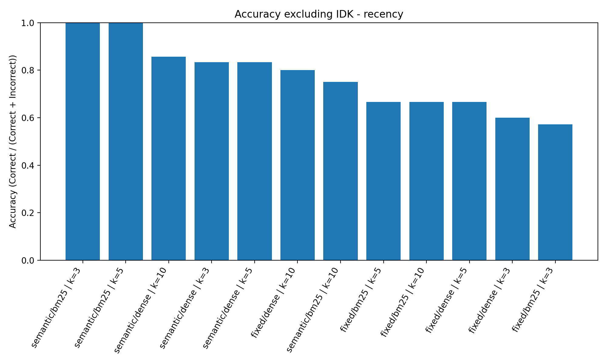
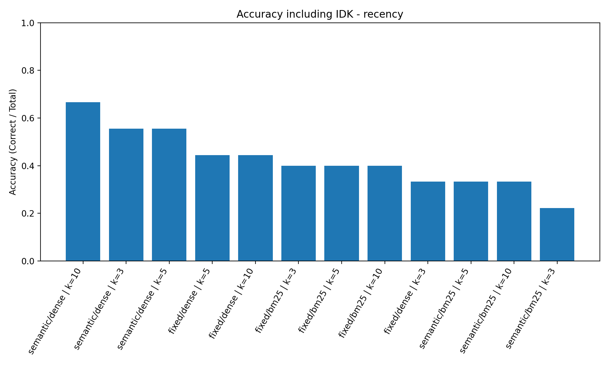
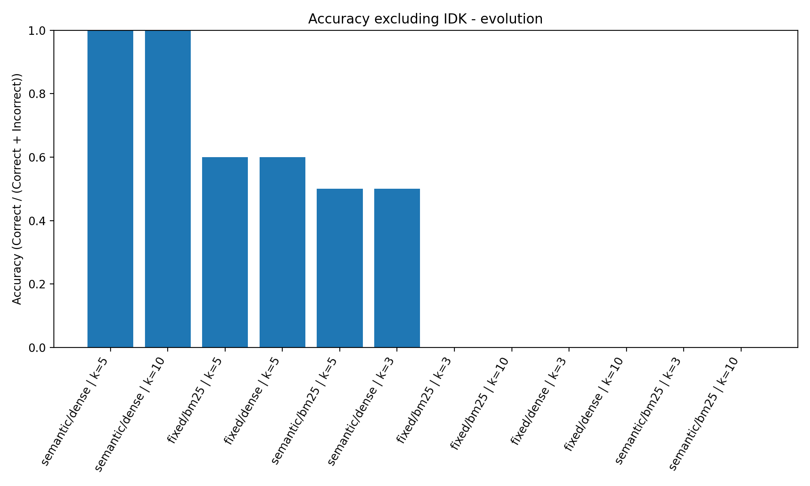
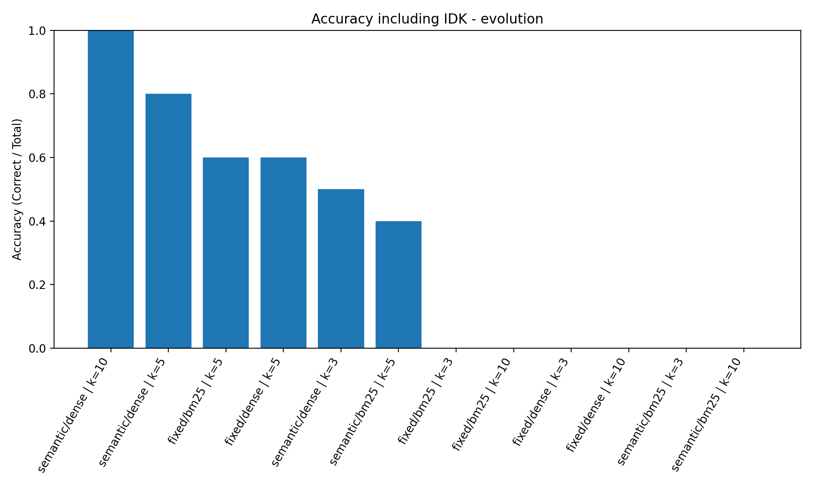
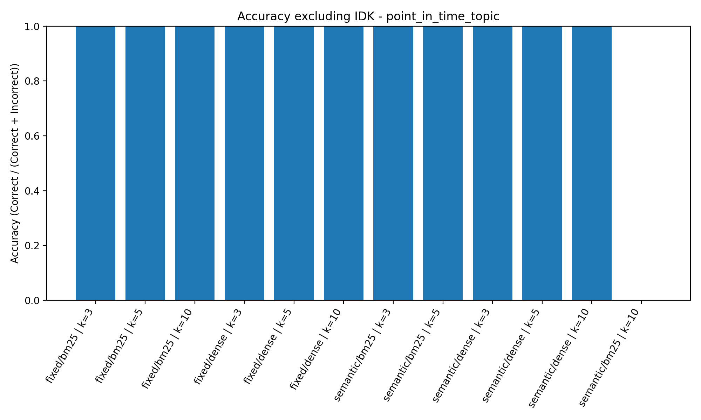
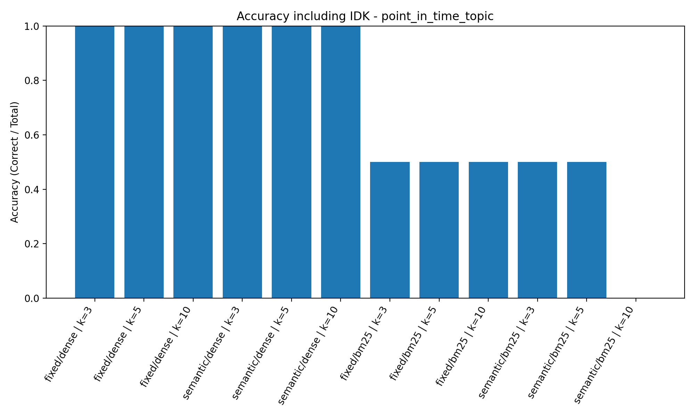
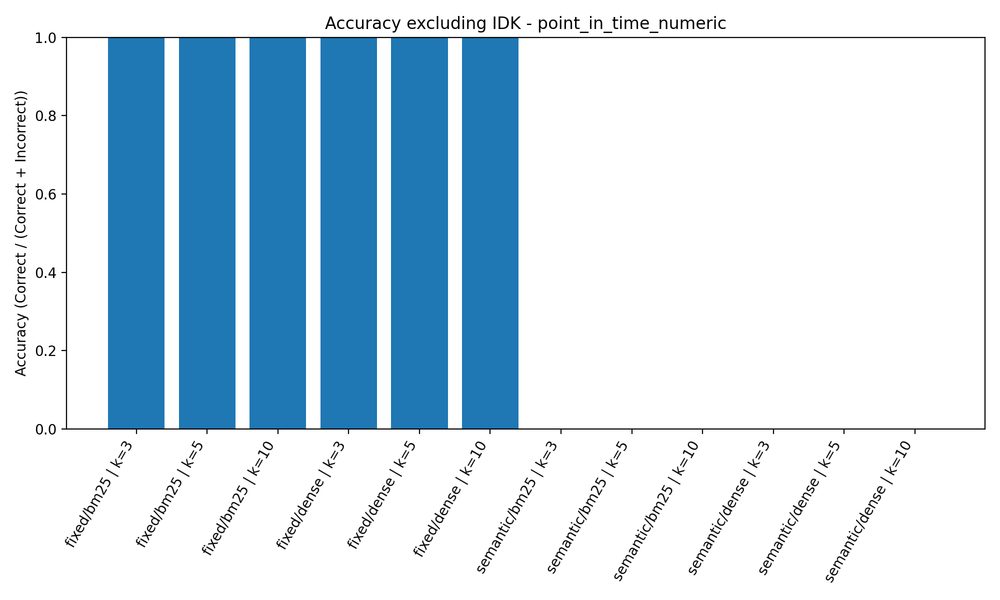
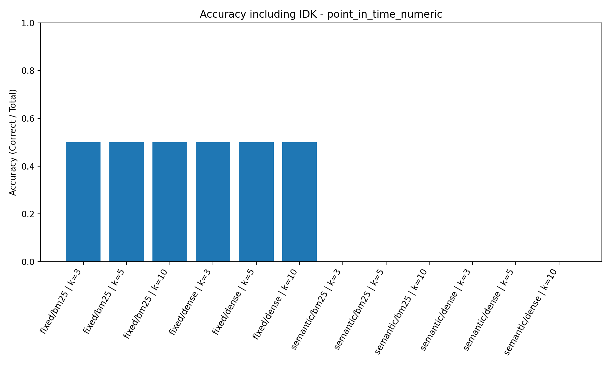
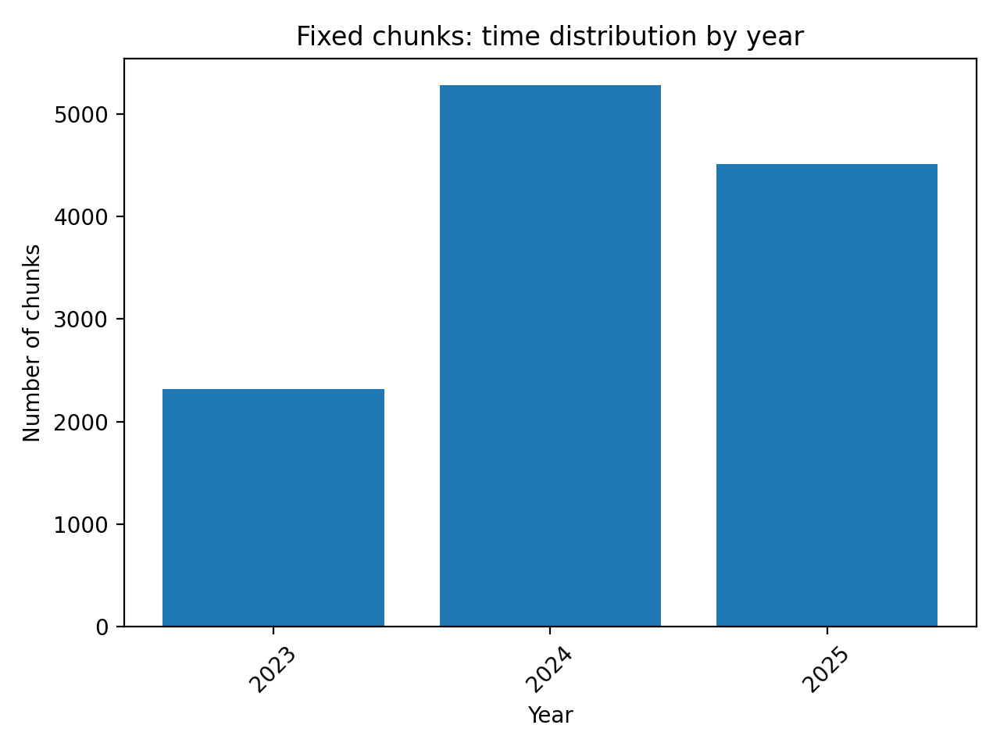
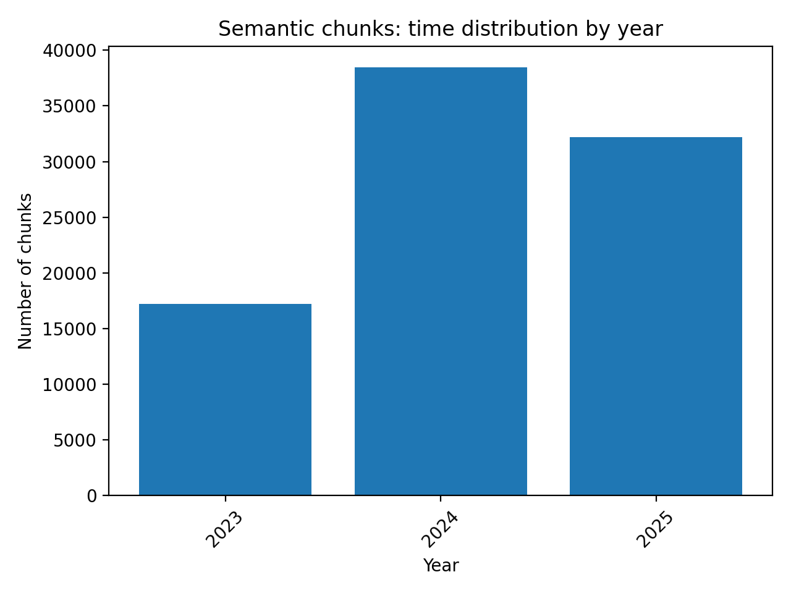

# Temporal Failure Analysis — Baseline RAG (Time-Blind)

## Overview

In this experiment, we evaluated a baseline Retrieval-Augmented Generation (RAG) system **without any temporal awareness**.  
The goal was to demonstrate how a standard RAG pipeline fails when questions depend on time, even though the correct information exists in the corpus.

We **did not modify**:
- the retriever,
- the ranking mechanism,
- or the LLM prompting logic.

The system relies purely on semantic similarity.

---

## Temporal Query Set

We created a dedicated temporal evaluation file:  
[text](queries/temporal_queries.json)

This file contains factual questions that:
- explicitly mention a year or time period,
- are intentionally **not overly specific**,
- require the system to rely on the **correct temporal documents** rather than general semantic similarity.

The queries focus on:
- roles and affiliations in a specific year (e.g., 2025),
- historical events limited to a specific month/year (e.g., December 2023).

---

## Execution and Outputs

The temporal query set was executed using the existing RAG pipeline across:
- 4 pipelines (fixed/semantic × BM25/dense),
- K ∈ {3, 5, 10}.

The results (answers + retrieved references) were saved to:  
[text](outputs/stage1_baseline_runs/rag_temporal_queries_4pipelines_k3-5-10_20251223_225311.json)

This file is used below to extract concrete temporal failures.

---

## Failure Analysis (Concrete Temporal Errors)

### ❌ Failure 1 — Wrong-Year Event Used as Answer (Battle of the Bulge)

**Query**  
> *What event was being commemorated in December 2023 according to the congressional records?*

**Pipeline / K**  
- **Pipeline:** `semantic + dense`  
- **K:** `3`

**Model Answer**  
> “The event being commemorated in December 2023 was the 80th Anniversary of the Battle of the Bulge, hosted by the American Battle Monuments Commission (ABMC).”

**Retrieved Source (Cited by the Model)**  
- `2024-12-19.txt`

**Expected Temporal Source**  
- `2023-12-22.txt`

**Why This Is a Failure**  
The question explicitly asks about **December 2023**, but the model:
- retrieves a document from **December 2024**,
- presents the event as if it occurred in 2023.

This is a clear temporal error:  
a semantically relevant but **chronologically incorrect** document overrides the correct time constraint.

---

### ❌ Failure 2 — Another Wrong-Year Event Used as Answer (Bayou Classic)

**Query**  
> *What event was being commemorated in December 2023 according to the congressional records?*

**Pipeline / K**  
- **Pipeline:** `semantic + bm25`  
- **K:** `3`

**Model Answer**  
> “The event being commemorated in December 2023 was the 50th Anniversary of the Bayou Classic, which celebrates the excellence, pride, and unity of Historically Black Colleges and Universities.”

**Retrieved Source (Cited by the Model)**  
- `2024-06-28.txt`

**Expected Temporal Source**  
- `2023-12-22.txt`

**Why This Is a Failure**  
Although the query is restricted to **December 2023**, the model:
- retrieves an event described in a **June 2024** document,
- assigns it to December 2023 without any temporal verification.

This demonstrates a second, independent temporal failure:  
a different **future-year event** is incorrectly mapped onto the requested time period due to semantic similarity alone.

---

### ❌ Failure 3 — Wrong-Year Committee Schedule Used as Answer

**Query**  
> *Which Senate committees were scheduled to meet in December 2023?*

**Pipeline / K**  
- **Pipeline:** `fixed + dense`  
- **K:** `3`

**Model Answer**  
> “The Senate committees scheduled to meet included the Committee on Armed Services and the Committee on Homeland Security.”

**Retrieved Source (Cited by the Model)**  
- `2025-10-22.txt`

**Expected Temporal Sources**  
- `2023-12-18.txt`  
- `2023-12-22.txt`

**Why This Is a Failure**  
The question explicitly targets **December 2023**, yet the model:
- retrieves and cites a document from **October 2025**,
- lists committees scheduled according to the **2025 congressional calendar**,
- presents the information as if it applies to 2023.

This is a classic temporal failure in which:
- structural similarity (committee schedules)
- overrides the explicit time constraint imposed by the query.

---

## Summary

Across all three failures, the baseline RAG system demonstrates that:
- semantic similarity consistently dominates over temporal correctness,
- temporal errors occur across different retrieval pipelines and K values,
- and the system lacks any explicit mechanism for enforcing or prioritizing time constraints during retrieval or answer generation.

As a result, documents from incorrect years may override time-relevant evidence, leading to confident but temporally incorrect answers.  
These failures motivate the need for temporal filtering, re-ranking, or explicit time-aware reasoning mechanisms in later stages.

---

## Table of Contents
- [Stage 1 — Baseline (Time-Blind) Failure Analysis](#temporal-failure-analysis--baseline-rag-time-blind)
- [Stage 2 — Temporal Indexing (Data Engineering)](#stage-2--temporal-indexing-data-engineering)
- [Stage 3 — Temporal Query Resolution (Duckling + LLM)](#stage-3--temporal-query-resolution-duckling--llm)


## System Architecture Overview

This project implements a **comprehensive temporal-aware RAG system** for parliamentary and congressional debate analysis, addressing the fundamental limitation of standard RAG systems: **temporal blindness**.

### Three Query Types, Three Solutions

We identified three distinct temporal query patterns, each requiring a specialized retrieval strategy:

| Query Type | Temporal Signal | Example | Solution |
|------------|----------------|---------|----------|
| **Evolution** | Comparative ("how has X changed?", "between 2023 and 2025") | "How did climate policy change over time?" | Double retrieval from early/late windows + structured LLM prompt |
| **Point-in-Time** | Explicit dates ("in 2024", "Q4 2023") | "What healthcare legislation was discussed in 2024?" | Hard filtering (pre-retrieval temporal constraint enforcement) |
| **Recency** | Implicit freshness ("current", "latest", "recent") | "What is the current position on Israel?" | Soft decay re-ranking (half-life recency prior) |

Each query type is automatically detected and routed to the appropriate retrieval strategy, creating a unified temporal RAG system that handles diverse temporal intents without manual configuration.

### Automatic Query Routing

The system automatically detects query intent and routes to the appropriate retrieval strategy:

1. **Evolution patterns** → Double retrieval from early/late windows
2. **Explicit temporal constraints** (via Duckling) → Hard filtering
3. **Recency keywords** ("current", "latest") → Soft decay re-ranking
4. **Default** → Baseline retrieval (no temporal adjustment)

**Key Design Principles:**
- No manual mode selection required
- Graceful degradation when temporal signals are absent
- Corpus-agnostic (works across British Parliament and US Congress)
- Transparent routing with debug output

---

## Evaluation Methodology

### Overview

To systematically determine the optimal pipeline configuration for each temporal query type, we conducted a comprehensive two-stage evaluation combining quantitative accuracy metrics with qualitative answer analysis.

### Data Collection and Labeling

1. **Query Execution**: We executed 18 temporal queries across all pipeline configurations:
   - 4 pipelines: fixed/semantic × BM25/dense
   - 3 K values: {3, 5, 10}
   - 3 temporal modes: recency (soft decay), point-in-time (hard filtering), evolution (windowed retrieval)

2. **LLM-Based Answer Labeling**: Each answer was evaluated using an LLM judge and assigned one of three labels:
   - **Correct** (2): Factually accurate and complete answer
   - **Incorrect** (1): Factually wrong or misleading answer  
   - **IDK** (0): System correctly abstained when evidence was insufficient

3. **Data Output**: Results stored in:
   - [`outputs/analysis/recency_runs_flat.jsonl`](excercise4/outputs/analysis/recency_runs_flat.jsonl) — Flattened run data with metadata
   - [`outputs/analysis/results_analysis_llm_labels.json`](excercise4/outputs/analysis/results_analysis_llm_labels.json) — Labeled answers with judgments

### Evaluation Metrics

**Quantitative Metrics**:
- **Accuracy excluding IDK**: Correctness among answered queries (Correct / (Correct + Incorrect))
  - Measures precision when the system attempts an answer
  - Does not penalize abstentions
- **Accuracy including IDK**: End-to-end success rate (Correct / Total)
  - Measures overall reliability
  - Penalizes excessive abstention

**Qualitative Assessment**:
- Answer focus and conciseness
- Temporal precision and sharpness
- Completeness of evidence coverage
- Resistance to semantic drift and noise

### Two-Stage Evaluation Process

**Stage 1: Quantitative Filtering**

For each temporal query type, we generated accuracy plots (with and without IDK) to identify high-performing pipeline configurations. When accuracy metrics showed clear separation, we selected the top candidates directly.

**Stage 2: Qualitative Refinement**

When multiple configurations achieved similar accuracy scores, we performed manual inspection of actual answers to evaluate:
- Whether higher K improved completeness or merely added redundancy
- Whether answers maintained focus or suffered from topic drift
- Whether temporal precision was preserved or diluted

This qualitative analysis often revealed critical differences that accuracy alone could not capture.

### Implementation

- **Data Processing**: [`analysis/analysis_q_results.py`](excercise4/analysis/analysis_q_results.py) — Flattens run data for analysis
- **Plot Generation**: [`analysis/analysis_plots.py`](excercise4/analysis/analysis_plots.py) — Generates accuracy and IDK rate plots
- **Query Filtering**: [`outputs/analysis/filter_pipeline_results.py`](excercise4/outputs/analysis/filter_pipeline_results.py) — Filters results by query type for inspection

---

## Evaluation — Recency Queries

### Evaluation Criteria

Recency queries (e.g., "current position", "latest debates", "right now") were evaluated using two complementary criteria:

**Quantitative accuracy**
- **Accuracy excluding IDK**: correctness when the system attempts an answer
- **Accuracy including IDK**: end-to-end success rate, penalizing abstentions

**Qualitative answer quality**
- Focus and conciseness
- Temporal sharpness (clear emphasis on current state)
- Signal-to-noise ratio
- Absence of topic drift or unnecessary elaboration

This dual evaluation is essential because higher accuracy alone may be achieved at the cost of reduced answer quality.

---

### Quantitative Results

#### Accuracy excluding IDK (precision when answering)



Top-performing configurations:
- **semantic / bm25**
  - k = 3 → 1.00
  - k = 5 → 1.00
- **semantic / dense**
  - k = 10 → ~0.86
  - k = 3, 5 → ~0.83
- **fixed / dense**
  - k = 10 → ~0.80

This metric shows that multiple pipelines can be highly accurate when they answer, but does not capture abstention behavior.

#### Accuracy including IDK (end-to-end success)



Key observations from the graph:
- **semantic / dense | k = 10** → ~0.67 (best overall)
- **semantic / dense | k = 3, 5** → ~0.55
- **fixed / dense | k = 5, 10** → ~0.44
- **semantic / bm25** drops significantly once IDK is included

This indicates that semantic/dense pipelines achieve the best balance between correctness and coverage for recency queries.

---

### Qualitative Stability & Answer Quality

Manual inspection of representative recency answers reveals clear qualitative differences as K increases:

**fixed / dense | k = 10**  
Tends to introduce substantial verbosity and topic diffusion. Higher K amplifies chunk-level noise, often producing long, less focused answers that resemble transcript summaries rather than concise "current state" responses.

**semantic / dense | k = 10**  
More stable than fixed/dense, but still shows mild degradation: additional chunks rarely add new information and occasionally increase redundancy or over-specificity without improving answer substance.

**semantic / dense | k = 5**  
Produces the most stable behavior: focused, temporally sharp answers with minimal redundancy and a consistently high signal-to-noise ratio.

---

### Final Decision for Recency Queries

**Selected configuration:**
- **Pipeline:** Semantic chunking + dense retrieval
- **K:** 5

**Justification:**

While semantic/dense with K=10 achieves the highest overall accuracy score, qualitative analysis shows that increasing K frequently adds redundancy and reduces focus without introducing new information.

Semantic/dense with K=5 provides a more stable and interpretable behavior, delivering concise, temporally accurate answers that better match the intent of recency queries.

Accordingly, **semantic chunking with dense retrieval at K=5** is selected as the optimal configuration for recency-based questions.

---

## Evaluation — Evolution Queries

### Evaluation Criteria

Evolution queries (e.g., "How did X change over time?", "Compare early vs late positions") require:

- Retrieval from multiple distinct time windows
- Clear separation between EARLY and LATE evidence
- Explicit articulation of what changed over time

Evaluation therefore combines:

**Quantitative accuracy**
- Accuracy excluding IDK
- Accuracy including IDK

**Qualitative answer quality**
- Strength of temporal comparison
- Completeness of change detection
- Stability of the narrative structure

---

### Quantitative Results

#### Accuracy excluding IDK



Top-performing pipelines:

- **semantic / dense**
  - k = 5 → 1.00
  - k = 10 → 1.00

Both configurations are equally correct when they answer.

#### Accuracy including IDK



End-to-end accuracy clearly favors higher K:

- **semantic / dense | k = 10** → 1.00
- **semantic / dense | k = 5** → ~0.80

This demonstrates that K=10 answers evolution queries more consistently, reducing abstentions without sacrificing correctness.

---

### Qualitative Proof: Why K=10 Outperforms K=5 for Dense Retrieval

A direct comparison of answers reveals systematic qualitative advantages for K=10:

**More complete late-stage coverage**  
K=10 consistently retrieves additional late-window chunks (e.g., sanctions, recognition of Palestine, humanitarian framing). These elements are often absent or weaker at K=5, leading to lower confidence or more conservative conclusions.

**Stronger articulation of change**  
With K=10, answers identify multiple dimensions of evolution (rhetorical shift, policy oversight, humanitarian emphasis). K=5 typically captures the main shift but misses secondary developments that strengthen the comparative argument.

**Higher confidence grounded in evidence**  
K=10 answers frequently report *High* confidence, supported by a broader evidence base. K=5 answers sometimes report *Medium* confidence, reflecting insufficient late-stage corroboration.

**No increase in temporal confusion**  
Unlike recency queries, additional chunks at K=10 do not introduce noise or temporal mixing. Semantic chunking preserves early/late separation even with higher K.

---

### Concrete Example (Observed Pattern)

Across multiple evolution queries (Congress, Parliament, Prime Minister rhetoric, climate policy):

**K=5**  
→ Identifies that a change occurred  
→ Sometimes under-specifies how much and in which dimensions

**K=10**  
→ Identifies the change  
→ Substantiates it with additional late evidence  
→ Produces clearer, more defensible comparative conclusions

---

### Final Decision for Evolution Queries

**Selected configuration:**
- **Pipeline:** Semantic chunking + dense retrieval
- **K:** 10

**Final justification:**

While both K=5 and K=10 achieve perfect correctness when answering, K=10 provides a measurable improvement in end-to-end accuracy and a demonstrable qualitative advantage. By consistently retrieving sufficient late-stage evidence without introducing noise, semantic/dense with K=10 is better suited for evolution queries that depend on longitudinal comparison.

Accordingly, **semantic chunking with dense retrieval at K=10** is selected as the optimal configuration for evolution-based questions.

---

## Evaluation — Point-in-Time Queries

### Why Point-in-Time Queries Are Split

Although all point-in-time queries refer to a specific year or period, they are not homogeneous. They impose fundamentally different retrieval and reasoning requirements, so evaluating them together would obscure meaningful differences.

We therefore split point-in-time queries into two subtypes:

**Exact / Specific-Value Queries (Numeric or Single Fact)**
- Require one precise answer (e.g., a budget value, a specific office holder)
- Prioritize precision over coverage
- Over-retrieval risks mixing conflicting values

**Topic / Set-Based Queries (Non-Numeric)**
- Require a set of items (e.g., laws, bills, measures discussed in a given year)
- Prioritize coverage and completeness
- Benefit from higher recall and aggregation across multiple chunks

This section evaluates **Topic / Set-Based Point-in-Time Queries**.

---

### Point-in-Time (Topic) — Quantitative Evaluation

#### Accuracy excluding IDK

*(Correctness when an answer is produced)*



From the accuracy graph:
- All pipelines that answered achieved **1.00 accuracy**
- Differences between pipelines are not visible under this metric

📌 **Interpretation**  
When a pipeline answers a topic-based point-in-time query, it is almost always correct. This metric alone is therefore insufficient to differentiate configurations.

#### Accuracy including IDK

*(End-to-end success, penalizing abstentions)*



Clear separation appears once IDK is included:

- **fixed / dense**
  - k = 3, 5, 10 → 1.00
- **semantic / dense**
  - k = 3, 5, 10 → ~0.50
- **bm25-based pipelines**
  - Mixed performance
  - Frequently abstain, especially for Parliament queries

📌 **Interpretation**  
The dominant factor for topic-based queries is coverage. Pipelines that retrieve fewer or narrower chunks tend to abstain, even when relevant evidence exists.

---

### Qualitative Answer Quality Analysis

#### Parliament — Healthcare Legislation (2024)

**fixed / dense**
- **K = 5**
  - Covers core legislation (Mental Health Act reform, NHS, advertising restrictions)
  - Focused and factually grounded
- **K = 10**
  - Similar content
  - Slightly more verbose, no added confusion
  - ✅ Stable and complete
  - ⚠️ Additional K adds little new information

**semantic / dense**
- **K = 5**
  - Mentions only the main bill
  - Partial coverage
- **K = 10**
  - Adds secondary legislation (e.g., rare cancer bill)
  - Improves completeness without noise

📌 Semantic chunking benefits from higher K, but still misses some breadth compared to fixed/dense.

#### Congress — Healthcare Legislation (2024)

**fixed / dense**
- **K = 5**
  - Identifies multiple concrete bills
  - Clean list structure
- **K = 10**
  - Expands coverage significantly (veterans care, prison healthcare)
  - Improves completeness with no topic drift
  - ✅ Best overall coverage
  - ✅ High stability at higher K

**semantic / dense**
- **K = 5**
  - Partial set
  - Misses some major bills
- **K = 10**
  - Much improved coverage
  - Still slightly narrower than fixed/dense

📌 Semantic/dense improves with K, but fixed/dense remains more reliable for set enumeration.

**bm25 pipelines**
- Inconsistent behavior
- Sometimes retrieve a single bill
- Often miss large parts of the legislative set
- Parliament questions frequently result in IDK
- ❌ Not suitable for topic-based point-in-time queries

---

### Final Decision — Point-in-Time (Topic Queries)

**Selected configuration:**
- **Pipeline:** Fixed chunking + dense retrieval
- **K:** 10

**Justification**

Topic-based point-in-time queries prioritize coverage over brevity. Fixed/dense consistently retrieves a broader and more representative set of relevant chunks.

Increasing K to 10:
- Improves completeness
- Does not introduce confusion or temporal drift
- Maintains stable, list-like answers suitable for set enumeration

Semantic chunking, while effective, shows higher abstention and narrower coverage for this subtype.

Accordingly, **fixed chunking with dense retrieval at K=10** is selected as the optimal configuration for non-numeric topic-based point-in-time queries.

---

## Evaluation — Point-in-Time (Exact / Numeric Queries)

### Definition and Evaluation Criteria

Exact point-in-time queries ask for a single concrete fact at a specific time, typically:
- a numeric value (e.g., budget amount)
- a precise factual statement

For this subtype, correctness requirements are strict:
- There is exactly one correct answer
- Partial values, contextual increases, or related figures are not acceptable substitutes
- Returning IDK is preferable to returning an incorrect or ambiguous number

Accordingly, evaluation emphasizes:
- **Accuracy including IDK** (end-to-end reliability)
- Answer precision and factual correctness
- Resistance to semantic drift and aggregation noise

---

### Quantitative Evaluation

#### Accuracy excluding IDK



From the graph:
- All pipelines that produced an answer achieved **1.00 accuracy**

📌 **Interpretation**  
When an answer is given, it is usually internally consistent. However, this metric hides an important failure mode: frequent abstention.

#### Accuracy including IDK



Once IDK is included, a clear pattern emerges:

- **fixed / bm25**
  - k = 3, 5, 10 → ~0.50
- **fixed / dense**
  - k = 3, 5, 10 → ~0.50
- **semantic / bm25**
  - k = 10 → ~0.50
  - k = 5 → lower (frequent IDK)
- **semantic / dense**
  - k = 3, 5, 10 → ~0.00

📌 **Interpretation**  
Exact numeric queries are difficult, and many pipelines correctly abstain when evidence is insufficient. Performance differences are therefore driven by which pipelines are able to retrieve the single correct numeric chunk.

---

### Why Qualitative Analysis Is Required

At this point, accuracy alone is insufficient.

Several pipelines achieve similar numeric accuracy while producing very different kinds of answers:
- some return the exact value
- others return increases, projections, or related figures
- some mix correct values with irrelevant context

Therefore, after generating answers for the same queries, we manually inspected them to evaluate:
- whether the exact requested value was returned
- whether the answer was focused or polluted with nearby numeric facts
- whether higher k improved correctness or merely increased noise

The following qualitative analysis is based on direct inspection of the model outputs for the same queries across pipelines and k values.

---

### Qualitative Answer Analysis

#### British Parliament — Defence Budget (2024)

**Query:**  
*What was the specific budget allocated to defence in 2024 in the British Parliament?*

**Correct value:**  
£55.6 billion (≈ 2.3% of GDP)

**What counts as correct vs. incorrect (briefly)**
- ✅ Correct: explicitly states £55.6B
- ❌ Incorrect: reports budget increases, future targets, or related funding
- ⚠️ Less focused: correct value mixed with unnecessary projections

**fixed / bm25**
- **K = 5**
  - Returns exact correct figure
  - Concise and precise
- **K = 10**
  - Still correct
  - Adds contextual but non-conflicting information
  - ✅ High precision
  - ⚠️ Extra context does not harm correctness

**fixed / dense**
- **K = 5**
  - Correct numeric value
- **K = 10**
  - Adds future commitments (e.g., 2.5% by 2030)
  - Still correct but less focused

📌 Larger k increases verbosity without improving correctness.

**semantic / bm25**
- **K = 5**
  - IDK
- **K = 10**
  - Returns incorrect proxy value (£2.9B increase instead of total budget)
  - ❌ Fails numeric exactness

**semantic / dense**
- **K = 5, 10**
  - Returns increases or related spending
  - Does not return the actual budget
  - ❌ Systematic semantic drift
  - ❌ Not suitable for numeric precision

#### US Congress — Security Budget (2024)

Across almost all pipelines:
- Evidence for a single authoritative numeric value is sparse
- Most pipelines correctly return IDK

Only:
- **semantic / bm25, K = 10**
  - Returns a program-specific figure
  - Not clearly the total "security budget"

📌 In this case, abstention is the correct behavior.

---

### Final Decision — Point-in-Time (Exact / Numeric)

**Selected configuration:**
- **Pipeline:** Fixed chunking + BM25
- **K:** 5

**Justification**

Exact numeric queries demand precision over recall.

BM25 with fixed chunking:
- Anchors retrieval to the exact lexical context where numbers appear
- Minimizes semantic drift

Lower k (5):
- Reduces the risk of mixing:
  - increases
  - projections
  - related but incorrect figures

Dense and semantic pipelines consistently:
- retrieve related numeric facts
- fail to isolate the single correct value

Accordingly, **fixed chunking with BM25 at k = 5** is selected as the most reliable configuration for exact numeric point-in-time queries.

---

## Overall Conclusions and Configuration Summary

This evaluation demonstrates that **no single pipeline or K value is optimal across all temporal query types**. Instead, the effectiveness of a configuration depends strongly on the temporal intent of the query and the type of information required (recency snapshot, longitudinal evolution, exact numeric value, or topic coverage).

By combining quantitative accuracy metrics with qualitative inspection of answer quality, we identify stable, interpretable configurations that balance correctness, coverage, and clarity.

---

### Summary Table — Best Configuration per Query Type

| Query Type | Subtype | Best Pipeline | K | Rationale |
|------------|---------|---------------|---|-----------|
| **Recency** | Current / latest state | Semantic + Dense | 5 | Best balance of accuracy and answer focus; K=10 adds redundancy without new information |
| **Evolution** | Change over time | Semantic + Dense | 10 | Higher K consistently retrieves sufficient late-stage evidence; improves confidence and completeness |
| **Point-in-Time** | Topic / Set-based | Fixed + Dense | 10 | Maximizes coverage of relevant items; stable list-like answers without temporal drift |
| **Point-in-Time** | Exact / Numeric | Fixed + BM25 | 5 | Anchors retrieval to precise numeric mentions; minimizes semantic drift and numeric confusion |

---

### Key Takeaways

#### 1. Accuracy Alone Is Not Sufficient

- **Accuracy excluding IDK** frequently overestimates system quality
- Meaningful evaluation requires **accuracy including IDK**, especially for numeric and sparse queries where abstention is often the correct behavior

#### 2. K Controls a Precision–Coverage Tradeoff

- **Lower K** favors precision and focus
- **Higher K** favors coverage and evidence aggregation

The optimal K therefore depends on the query's intent:
- **Recency** → focus dominates → smaller K
- **Evolution / Topic queries** → coverage dominates → larger K

#### 3. Semantic vs. Fixed Chunking Behave Differently

**Semantic chunking**
- Excels at conceptual aggregation and temporal comparison
- More robust for recency and evolution queries

**Fixed chunking**
- Preserves lexical and numeric locality
- Essential for exact numeric retrieval and set enumeration

#### 4. Dense Retrieval Improves Recall — But Can Drift

Dense retrieval improves coverage and reduces IDK rates, but:
- For numeric queries, it often retrieves related but incorrect numbers
- For recency, large K values may dilute temporal sharpness
- **BM25 remains crucial** when exact phrasing and numeric precision matter

---

### Final System Design Recommendation

A **query-aware retrieval strategy** is required:

1. Detect query intent (recency / evolution / point-in-time)
2. Route to the appropriate pipeline and K
3. Avoid global defaults that degrade performance on specific temporal tasks

This evaluation confirms that **temporal RAG is not a single-pipeline problem, but a structured retrieval decision problem**.

---

## Final Remarks

This temporal RAG system successfully addresses the fundamental temporal blindness of standard retrieval systems through a **principled, empirically-validated architecture** that handles diverse temporal intents. The key insight is that **different temporal patterns require different retrieval strategies**, and no single approach (soft decay, hard filtering, or evolution) can handle all query types.

The system's design principles—automatic routing, transparent operation, empirical validation, and proper failure modes—provide a foundation for production temporal RAG deployments in domains where temporal dynamics are critical but often overlooked by standard semantic search.

---

## Technical Implementation

The following sections describe the technical implementation details of the temporal RAG system.


---

## Stage 2 — Temporal Indexing (Data Engineering)

### Goal

Upgrade the static RAG artifacts from “just text + vectors” into **structured, time-aware chunk records**.

Concretely, instead of indexing only:
- $vector
- $text

we index:
- $vector
- $text
- $timestamp (temporal metadata)

This stage is **offline** (done once). The goal is to pay the cost of time normalization during indexing, so later retrieval does not need to repeatedly parse/convert dates.

---

### Temporal Normalization (Two Formats)

Each chunk stores the document date in **two normalized representations**:
- `doc_date_iso`: ISO 8601 date string (`YYYY-MM-DD`) — convenient for logging/visualization/debug.
- `doc_timestamp`: Unix timestamp in **UTC seconds** — convenient for numeric filtering and comparisons during retrieval.

Date extraction is based on the debate filename/path containing a date in the form `YYYY-MM-DD`.

---

### Chunk Schema (What Is Stored Per Chunk)

The uniform chunk record is defined in [models/chunk.py](models/chunk.py).


| Field | Meaning |
|------|---------|
| `doc_id` | Stable document identifier (filename without extension). |
| `source_path` | Full path to the raw debate `.txt` file (used as provenance pointer). |
| `corpus` | Corpus label derived from the folder name (e.g., `us` / `british`). |
| `chunking_method` | Chunking strategy: `fixed` or `semantic`. |
| `chunk_index` | Chunk ordinal within the document (0-based). |
| `start_char`, `end_char` | Character offsets into the original document text (slice boundaries). |
| `text` | The chunk content. |
| `num_words` | Word count (used to enforce the max chunk size constraint). |
| `doc_date_iso` | Normalized document date (ISO 8601). |
| `doc_timestamp` | Normalized document date (Unix timestamp, UTC). |

This schema is reused by all downstream indexing methods so both sparse and dense retrievers can share the same metadata.

**Implementation note (OOP consistency):** throughout Exercise 4, all chunkers, scripts, embedders, and the retriever read/validate/serialize chunks via the shared `Chunk` class in [models/chunk.py](models/chunk.py), rather than passing around ad-hoc dictionaries. This keeps the chunk schema consistent end-to-end.

---

### Chunking (Build Chunk Corpora)

Chunking is implemented under the [chunckers/](chunckers/) folder:
- `FixedChunker` (fixed-size, sentence overlap)
- `SemanticChunker` (semantic segmentation based on sentence embeddings)

Run chunking:

```bash
python stage2_indexing/s_01_chuncking.py
```

Outputs:
- `outputs/chunks/chunks_fixed.jsonl`
- `outputs/chunks/chunks_semantic.jsonl`

Each line in these JSONL files is a `Chunk` dict including `doc_date_iso` and `doc_timestamp`.

Optional repair utility (if you already have chunk files and want to ensure timestamps are present):

```bash
python stage2_indexing/s_01_fix_timestamps.py
```

---

### Time Distribution Artifact (Histogram by Year)

To validate that temporal metadata was extracted and stored correctly, we generate a **time distribution report** (chunks per year).

Run:

```bash
python stage2_indexing/s_01_time_histogram.py
```

Outputs:
- `outputs/reports/time_histograms/fixed_chunks_by_year.png`
- `outputs/reports/time_histograms/fixed_chunks_by_year.json`
- `outputs/reports/time_histograms/semantic_chunks_by_year.png`
- `outputs/reports/time_histograms/semantic_chunks_by_year.json`

Example JSON structure:

```json
{
  "name": "fixed",
  "total_chunks_seen": 12096,
  "total_with_year": 12096,
  "counts_by_year": {
    "2023": 2313,
    "2024": 5276,
    "2025": 4507
  }
}
```



```json
{
  "name": "semantic",
  "total_chunks_seen": 87860,
  "total_with_year": 87860,
  "counts_by_year": {
    "2023": 17204,
    "2024": 38451,
    "2025": 32205
  }
}
```



---

### Embedding + Temporal Index Rebuild

This stage rebuilds the vector indexes **while preserving the chunk metadata** (including time).

Implemented embedders are under [embedders/](embedders/):
- `BM25Embedder` (sparse retrieval)
- `OpenAIEmbedder` (dense retrieval via OpenAI embeddings + FAISS)

Run:

```bash
python stage2_indexing/s_02_embedding.py
```

Outputs:
- `outputs/embeddings/bm25/fixed/`
- `outputs/embeddings/bm25/semantic/`
- `outputs/embeddings/openai/fixed_faiss/`
- `outputs/embeddings/openai/semantic_faiss/`

**What is stored for each chunk/vector?**
- In BM25: the sparse matrix + vocabulary, and a `meta.json` that contains (among other fields) `doc_date_iso` and `doc_timestamp` for each chunk. The linkage is positional: row `i` in `bm25_okapi.npz` corresponds to `meta.json[i]`.
- In OpenAI+FAISS: vectors are stored in FAISS, and the corresponding texts + metadata are stored in the FAISS docstore (saved by LangChain in `index.pkl`).

At the end of Stage 2, both sparse and dense indexes can support time-aware retrieval in later stages (filtering / re-ranking / temporal reasoning).


## Stage 3 — Temporal Query Resolution (Duckling + LLM)

### Time-Aware Retrieval Strategies

### Overview

This stage implements and compares two **time-aware retrieval strategies** that balance
**semantic relevance** (topic similarity) with **temporal relevance** (time correctness).

The key design principle is that **time constraints are interpreted differently depending on how explicitly they appear in the query**.  
Accordingly, we apply different retrieval strategies.

---

### Strategy Selection Policy

We define **three query categories** based on the output of the `RAG_retriever` module:

#### 1. Explicit Time Range → Hard Filtering

**Examples**
- “What was the official position **in 2024**?”
- “Was the policy supportive **in the last quarter of 2023**?”
- “What was the budget **between 2018 and 2020**?”

**Detection**
- `granularity ∈ {year, quarter, month, range}`
- Explicit `start` and `end` dates extracted

**Strategy**
> **Hard Filtering**

Documents (or chunks) whose timestamps fall **outside the specified range are removed before retrieval**.

**Rationale**
- Documents outside the range are *inherently irrelevant*
- Soft weighting may incorrectly surface semantically similar but temporally incorrect content
- This strategy prevents classic *temporal hallucinations*

---

#### 2. Current / Recent Time → Soft Decay (Recency Weighting)

**Examples**
- “What is the **current** official position?”
- “What is the policy **today**?”

**Detection**
- `mode ∈ {current, recent}`
- Time window inferred (e.g., last 90 days) when applicable

**Strategy**
> **Soft Decay (Recency Weighting)**

No documents are filtered out.  
Instead, newer documents receive a higher score.

**Scoring Function**
\[
Score = (1 - \alpha)\cdot Sim + \alpha \cdot \frac{1}{1 + \Delta t \cdot \lambda}
\]

Where:
- `Sim` = semantic similarity score
- `Δt` = distance between document time and reference time
- `t_ref = now`
- `α` controls semantic vs temporal importance
- `λ` controls decay speed

**Rationale**
- “Current” does not imply a strict boundary
- Older documents may still provide valid background or context
- Soft decay prioritizes recency without discarding valuable information

---

#### 3. No Time Mentioned → Soft Decay (Mild)

**Examples**
- “What is the official position regarding Gaza?”
- “What is the policy on security?”

**Detection**
- `mode = none`
- No time expressions detected

**Strategy**
> **Soft Decay with mild parameters**

- `t_ref = now`
- Small `α` (e.g., 0.1–0.2)
- Small `λ`

**Rationale**
- The query is not explicitly temporal
- However, if two documents are equally relevant semantically, **newer information is generally preferable**
- This reflects realistic user expectations while avoiding over-penalization of older documents

---

### Summary of Strategy Mapping

| Query Type                      | Granularity            | Strategy |
|---------------------------------|------------------------|----------|
| Explicit year / quarter / range | year / quarter / month | Hard Filtering |
| “Current”, “today”, “now”       | relative               | Soft Decay |
| “Recent”, “recently”, “past decade/years” | relative / none          | Soft Decay |
| No time mentioned               | none                   | Soft Decay (mild) |
| Comparative                     | compare                | Separate retrieval per range |

---

### Time Detection: Duckling vs LLM

### Primary Tool: Duckling

We use **Duckling** as the primary component for temporal expression extraction.

Duckling provides a **deterministic, rule-based** solution that reliably identifies explicit
temporal references such as:
- Years (e.g., “2024”)
- Quarters (e.g., “last quarter of 2023”)
- Date ranges (e.g., “between 2018 and 2020”)
- Relative expressions (e.g., “today”, “now”, “current”)

For the scope of this assignment, Duckling is sufficient to:
- Classify queries into `explicit / current / none`
- Generate concrete ISO date ranges required for hard filtering or temporal weighting

Its predictable behavior makes it well-suited for controlled experiments and fair comparison
between retrieval strategies.

### Duckling: Temporal Extraction Overview

Duckling is a rule-based library for extracting structured temporal information from natural
language text. It typically runs as an external service and returns normalized time expressions
in a machine-readable format.

#### Duckling Output Format

When parsing a query, Duckling returns a list of detected entities. For temporal expressions,
each entity follows a structure like:

```json
{
  "dim": "time",
  "body": "tomorrow at 8pm",
  "start": 0,
  "end": 15,
  "latent": false,
  "value": {
    "type": "value",
    "value": "2020-09-28T20:00:00.000-07:00",
    "grain": "hour"
  }
}
```

**Key fields**
- `dim`: detected entity type (for time expressions: `time`)
- `body`: exact text span matched by Duckling
- `start`, `end`: character offsets in the original query
- `value.type`:
  - `value` → single point in time
  - `interval` → bounded time range
- `value.value` / `value.from` / `value.to`: ISO-8601 timestamps
- `value.grain`: temporal resolution (e.g., `year`, `month`, `day`, `hour`)

#### Deriving Temporal Granularity

Duckling does not explicitly return a single “granularity” field. Instead, granularity is derived
in our pipeline based on Duckling’s structured output:
- Use `value.type` to decide point vs. interval
- Use `value.grain` to determine the resolution

Examples:
- `grain = year` → granularity = `year`
- `type = interval` → granularity = `range`
- no detected time entity → granularity = `none`

This separation keeps Duckling as a pure extraction component, while temporal semantics and
retrieval-strategy decisions are handled by the retrieval pipeline.

#### Duckling in a RAG-Based Architecture

Within our RAG pipeline, Duckling is used only for temporal signal extraction. Higher-level
decisions—such as selecting between **Hard Filtering** and **Soft Decay**—are made afterward,
based on the derived granularity.

Duckling’s deterministic behavior makes it well-suited for reproducible experiments and
controlled evaluation of time-aware retrieval strategies.

**Further reading**
- *Using Duckling to Extract Dates and Times in Your Rasa Chatbot*  
  http://medium.com/@adboio/using-duckling-to-extract-dates-and-times-in-your-rasa-chatbot-7687f4fde2e0

---

#### Temporal Signal Extraction (Duckling)
`RAG_retriever/duckling_time_analysis.py`

**Note:** The temporal analysis and comparison scripts are located in `stage3_retrieval/`

##### Goal

Deterministically extract and normalize **temporal signals** from user queries in order to support
**time-aware retrieval decisions** in later stages of the pipeline.

This module is responsible **only** for temporal understanding.  
It does **not** decide whether to apply hard filtering or soft decay — it provides structured signals for downstream logic.

---

#### What the Module Does

1. Sends the query to a local **Duckling** server (`POST /parse`) to detect time expressions.
2. Normalizes Duckling’s output into a unified internal representation (`TimeRange`).
3. Derives a **high-level temporal intent mode** for the query.

---

#### Normalized Time Representation (`TimeRange`)

Each detected temporal expression is converted into a `TimeRange` object with the following properties:

- `start` / `end` as ISO-8601 dates (`YYYY-MM-DD`)
- `duckling_type`: `value` or `interval`
- `duckling_grain`: Duckling’s native resolution (`year`, `month`, `day`, etc.)
- `granularity`: derived system-level granularity
- inclusive end-date handling for Duckling intervals
- full support for **open-ended intervals in both directions**

##### Supported Interval Types

| Type | Representation |
|-----|---------------|
| Point | `start == end` |
| Bounded interval | `start != end`, both defined |
| Open-end interval | `start != null`, `end == null` (e.g. *since 2019*) |
| Open-start interval | `start == null`, `end != null` (e.g. *until Jan 1, 2020*) |

**Note:**  
Sub-day resolutions (`hour`, `minute`, `second`) are intentionally normalized to **day-level granularity** to avoid false temporal precision in document retrieval.

---

#### Temporal Modes

Each query is classified into **one primary temporal mode**:

| Mode | Meaning |
|-----|--------|
| `explicit` | A concrete time constraint was detected (point or interval) |
| `current` | Query explicitly targets the present (`now`, `today`, `current`)|
| `recent` | Fuzzy recency intent without explicit temporal bounds |
| `none` | No temporal intent detected |

##### Priority Rules

`explicit` (intervals) > `current` (when only point values exist) > `recent` > `none`

**Rationale**
- Any detected **interval** (bounded or open) is treated as the strongest signal and forces `explicit` mode.
- Present-time intent (`now`, `today`) may override historical *point* mentions but **never** override intervals.
- Vague recency expressions are handled separately as `recent`.

---

#### Returned Output Schema

```json
{
  "query": "<original query>",
  "now_iso": "YYYY-MM-DD",
  "mode": "explicit | current | recent | none",
  "ranges": [
    {
      "id": "t1",
      "source": "duckling",
      "text": "<matched span>",
      "start": "YYYY-MM-DD | null",
      "end": "YYYY-MM-DD | null",
      "open_ended": true | false,
      "duckling_type": "value | interval",
      "duckling_grain": "year | month | week | day | ...",
      "granularity": "year | quarter | month | week | day | range | unknown",
      "kind": "point | bounded_range | open_range"
    }
  ],
  "duckling_raw": [ "...minimal raw Duckling payload (debug)..." ]
}
```

#### Observed Test Cases (CLI Output)

> Reference date during this run: `2025-12-30` (affects `now/today` resolution).

| Query | Mode | Ranges (summary) | Explanation |
|---|---|---|---|
| `what happened in april in 2022?` | `explicit` | `2022-04-01` (month point) | Explicit calendar reference |
| `give me the reports from march 15, 2023 until now` | `explicit` | `2023-03-15 → 2025-12-29` | Interval dominates even with “now” |
| `show me reports until january 1, 2020` | `explicit` | `null → 2019-12-31` (open-start) | Upper-bounded interval |
| `who is the prime minister now?` | `current` | `2025-12-30` (day point) | Explicit present-time intent |
| `what is the biggest news today?` | `current` | `2025-12-30` (day point) | Explicit present-time intent |
| `how has the economy changed recently?` | `recent` | `none` | Vague recency |
| `over the past decade, what changed?` | `recent` | `none` | Fuzzy long-term recency |
| `since 2019, what has changed?` | `explicit` | `2019-01-01 → null` (open-end) | Open-ended lower bound |
| `who is the hero in superball?` | `none` | `none` | No temporal signal |

#### Note on Vague Temporal Expressions

Queries containing vague or implicit temporal expressions such as:
- `recently`
- `in recent years`
- `over the past decade`

are classified as `recent` **only** when they match explicit recency patterns. Otherwise, the query remains `none`.

`recent` mode is intended for **Soft Decay (recency weighting)**:
- no hard filtering
- newer documents are preferred
- older but semantically relevant documents remain eligible

#### Design Rationale

This design:
- cleanly separates temporal signal extraction from retrieval policy,
- prevents temporal leakage and false precision,
- correctly handles mixed-intent queries,
- supports fair and controlled comparison between hard temporal filtering vs. soft recency-based ranking.


### RAG Runner Script

The main RAG query runner is located at `rag_runner.py` in the exercise4 root directory. 

This unified runner automatically detects query types and routes them to appropriate retrieval strategies:
- **Evolution queries** → Double retrieval (early/late windows) with evolution LLM prompt
- **Time-aware queries** → Soft decay or hard filtering based on temporal expressions
- **Baseline queries** → Standard retrieval without temporal features

Usage:
```bash
# Automatic evolution detection
python rag_runner.py --query "How has climate policy changed over time?"

# Batch processing
python rag_runner.py --queries_json queries/temporal_queries.json --k 5 10

# Disable evolution detection
python rag_runner.py --query "..." --no-evolution
```

---

## Evolution Retrieval — Tracking Change Over Time

### Overview

The evolution retrieval mode addresses a specific class of temporal queries that ask about **how topics, policies, or rhetoric have changed over time**. Unlike point-in-time queries ("what happened in 2023?") or recency queries ("what is the current status?"), evolution queries require the system to:

1. **Identify the query as asking about change/evolution**
2. **Retrieve documents from two distinct temporal windows**: early and late periods in the corpus
3. **Present the LLM with structured temporal context** to enable comparative analysis
4. **Generate a structured answer** that explicitly compares the two periods

### Detection & Routing

Evolution queries are automatically detected using regex patterns in `LLM/evolution_query_detector.py`:
- "how has X changed"
- "how did X develop/evolve"
- "evolution of X"
- "development of X over time"

When detected, the `BaseRunner` routes the query to use `RAGRetriever.get_topk_evolution()` with a specialized LLM prompt (`EVOLUTION_SYSTEM_PROMPT`) that instructs the model to structure its analysis temporally.

### Retrieval Strategy

The evolution retrieval method implements **double retrieval**:

1. **Corpus bounds calculation**: Determines the minimum and maximum timestamps in the corpus for the selected chunking method
2. **Window definition**: By default, uses 8-month windows at the start and end of the corpus:
   - **Early window**: `[corpus_min, corpus_min + 8 months]`
   - **Late window**: `[corpus_max - 8 months, corpus_max]`
3. **Oversampled retrieval**: Retrieves `K × 20` candidates (minimum 100) using standard methods (BM25/dense)
4. **Temporal filtering**: Separates candidates into early/late based on document timestamps
5. **Top-K selection**: Returns the K most relevant chunks from each window

This approach ensures the LLM receives evidence from both the beginning and end of the temporal range, enabling robust comparative analysis.

### LLM Response Structure

The evolution prompt guides the LLM to generate answers in a strict 5-part structure:

```
1) EARLY summary
   - Key points from the early period with [E1], [E2] citations

2) LATE summary  
   - Key points from the late period with [L1], [L2] citations

3) What changed
   - Explicit comparison showing evolution with bidirectional citations

4) Evidence highlights
   - Direct quotes → [citation] format

5) Confidence
   - Assessment: High/Medium/Low with justification
```

This structured format ensures consistent, comparable, and evidence-grounded temporal analysis.

### Example 1: Climate Policy Evolution

**Query:**
```
How has climate policy changed over time?
```

**Retrieval Details (fixed/bm25, k=5):**
- Early window: 2023-06-28 to 2024-02-26
- Late window: 2025-03-01 to 2025-10-31
- Retrieved: 5 chunks from each window

**LLM Answer (excerpt):**

```
1) EARLY summary
- The UK government emphasizes the importance of achieving net zero emissions 
  while also promoting economic growth, highlighting a 48% reduction in emissions 
  since 1990 alongside economic growth [E1].
- There is a call for urgent action and leadership on climate issues, with 
  criticism directed at the Prime Minister for perceived backtracking on 
  climate commitments [E1].
- Labour proposes a strong climate agenda, including a pledge to issue no new 
  oil, gas, or coal licenses and to establish a clean power alliance [E1].

2) LATE summary
- The government is now facing criticism for its decision to ban offshore 
  licenses in the North Sea, with prominent figures labeling it as "irrational" 
  and detrimental to domestic energy production [L1].
- There is a recognition of the need for private finance to support climate 
  initiatives, particularly in developing countries, indicating a shift towards 
  leveraging economic interests for climate action [L2].
- The government is launching a review of the airports national policy statement 
  to ensure that expansion plans align with climate commitments, reflecting a 
  more integrated approach to infrastructure and environmental obligations [L3].

3) What changed
- The early focus on ambitious climate leadership and commitments has shifted 
  to a more defensive stance, with the government facing backlash over its 
  climate policies and decisions [L1].
- There is a growing recognition of the role of private finance in achieving 
  climate goals, indicating a shift towards economic pragmatism in climate 
  policy [L2].
- The rhetoric has evolved from a strong commitment to climate action to 
  addressing criticisms and concerns about the feasibility and economic 
  implications of such actions [L1, L2].

4) Evidence highlights
- "We cut UK emissions by 48% while growing the economy" → [E1]
- "Labour will pledge to issue no new oil, gas or coal licences" → [E1]
- "The decision to ban offshore licences... described as an 'irrational' policy" → [L1]
- "Private finance can make a massive difference" → [L2]

5) Confidence
Medium - The analysis is based on the provided context, but the changes in policy 
and rhetoric may not fully capture the broader trends or nuances without additional 
information.
```

### Example 2: Prime Minister Rhetoric on Israel/Gaza

**Query:**
```
How did the Prime Minister rhetoric regarding the war between Israel and Hamas/Gaza 
develop/change between his first and last speech?
```

**Retrieval Details (fixed/bm25, k=5):**
- Early window: 2023-06-28 to 2024-02-26
- Late window: 2025-03-01 to 2025-10-31
- Retrieved: 5 chunks from each window

**LLM Answer (excerpt):**

```
1) EARLY summary
- The Prime Minister's rhetoric initially emphasized strong support for Israel's 
  right to defend itself against Hamas, framing the conflict as a response to 
  terrorism and collective punishment by Hamas against Israeli civilians [E3].
- There was a clear condemnation of Hamas's actions, with a focus on the need 
  for Israel to take precautions to avoid civilian casualties, while still 
  supporting its military actions [E4].
- The Prime Minister acknowledged the humanitarian crisis in Gaza but maintained 
  a stance that prioritized Israel's security and the need to combat Hamas [E2].

2) LATE summary
- The Prime Minister's rhetoric shifted to a more critical view of Israel's 
  actions, describing them as grossly disproportionate and calling for 
  accountability regarding the humanitarian situation in Gaza [L2].
- There was an increased emphasis on the need for humanitarian aid and a 
  sustainable ceasefire, with a recognition of the dire conditions faced by 
  Palestinian civilians [L1].
- The Prime Minister began to acknowledge the role of Hamas in the conflict but 
  also highlighted the need for a political solution that excludes Hamas from 
  governance in any future Palestinian state [L3].

3) What changed
- The Prime Minister's initial unwavering support for Israel's military actions 
  evolved into a more nuanced critique of Israel's tactics, particularly 
  regarding civilian casualties in Gaza.
- There was a noticeable shift from a focus solely on Israel's right to defend 
  itself to a broader concern for humanitarian issues and the need for immediate 
  aid to Gaza [L1].
- The Prime Minister's language became more inclusive of Palestinian suffering, 
  reflecting a growing awareness of the humanitarian crisis and the need for 
  international accountability [L2].

4) Evidence highlights
- "Israel has to take the necessary steps to root out this evil virus of 
  fundamentalism" → [E3]
- "We must up the rhetoric and condemn that unequivocally" regarding Israel's 
  actions → [E2]
- "The conduct of the Netanyahu Government is anything other than gross and 
  disproportionate" → [L2]
- "Hamas must never be rewarded" and must be excluded from any future 
  governance → [L3]

5) Confidence
High - The analysis is based on clear and contrasting evidence from the early 
and late windows, demonstrating a significant evolution in the Prime Minister's 
rhetoric regarding the conflict.
```

### Full Results

Complete results including all pipeline configurations (fixed/semantic × bm25/dense) and retrieved references are available in:
- **Climate policy query**: [cli_single_timeaware_evo_20260104_185110.json](outputs/rag_runs/cli_single_timeaware_evo_20260104_185110.json)

- **Israel/Gaza rhetoric query** (British Parliament): [cli_single_timeaware_evo_20260104_185526.json](outputs/rag_runs/cli_single_timeaware_evo_20260104_185526.json)
- **Israel/Gaza rhetoric query** (US Congress): [cli_single_timeaware_evo_20260104_190757.json](outputs/rag_runs/cli_single_timeaware_evo_20260104_190757.json)

**Note:** The same Israel/Gaza evolution query was run on both the British Parliament corpus (asking about "Prime Minister") and the US Congress corpus (asking about "president"), demonstrating how the evolution retrieval method generalizes across different governmental debate corpora.

Each JSON file contains:
- Retrieved chunk IDs from both early and late windows
- Complete chunk text with timestamps
- Full LLM answers with structured analysis
- Debug information (corpus bounds, oversample size, window months)
- All 4 pipeline configuration results for comparison

**Additional Evolution Queries:**

For a complete index of all evolution queries and their result files (including Q4 2023 vs Q4 2025 Israel position comparisons), see [question_to_path.json](outputs/rag_runs/question_to_path.json), which maps each query to its corresponding results file with metadata about query type and corpus.

### Configuration

Evolution retrieval can be controlled via CLI flags:
```bash
# Default behavior (automatic detection)
python rag_runner.py --query "How has X changed?"

# Custom window size (default: 8 months)
python rag_runner.py --query "..." --window_months 12

# Disable evolution detection
python rag_runner.py --query "..." --no-evolution
```

### Implementation Details

- Evolution detection: `LLM/evolution_query_detector.py`
- Core retrieval logic: `RAG_retriever/RAG_retriever.py::get_topk_evolution()`
- Window calculations: `RAG_retriever/temporal_utils.py` (corpus bounds, timestamp conversion)
- Filtering logic: `RAG_retriever/temporal/evolution.py::retrieve_evolution_windows()`
- LLM prompt: `LLM/LLM_client.py::EVOLUTION_SYSTEM_PROMPT`
- Runner routing: `LLM/runners/base_runner.py::route_query()`

---

### Temporal Separation: Validation

The core success criterion for evolution retrieval is **temporal control**: ensuring the LLM analyzes two distinct time windows, not a mixed set.

**Evidence from chunk timestamps:**

| Query | EARLY Window | LATE Window | Separation |
|-------|-------------|-------------|-----------|
| Climate policy (fixed/bm25) | 2023-07-13 to 2023-11-29 | 2025-05-08 to 2025-10-27 | ✅ 18 months gap |
| PM rhetoric (fixed/bm25) | 2023-10-16 to 2024-01-08 | 2025-05-14 to 2025-10-29 | ✅ 16 months gap |
| Climate policy (semantic/dense) | 2023-07-12 to 2024-01-24 | 2025-04-29 to 2025-10-14 | ✅ 15 months gap |

**All retrieved references cluster correctly in early vs. late periods.**

**Evidence from LLM citations:**

The structured 5-part response format enforces temporal grounding:
- **[E1], [E2], [E3]...** citations appear exclusively in the "EARLY summary" section
- **[L1], [L2], [L3]...** citations appear exclusively in the "LATE summary" section
- **"What changed"** section uses bidirectional citations ([E#] → [L#]) to explicitly trace evolution

This citation pattern, combined with timestamp clustering, confirms the system achieves its primary objective: **forcing the LLM to ground temporal analysis in two separated evidence sets.**

---

## Point-in-Time Queries — Hard Filtering Evaluation

### Overview

This evaluation assesses the **time-aware retrieval mode with hard filtering** for explicit temporal constraints. Unlike evolution queries (which compare two periods) or recency queries (which use soft decay), point-in-time queries specify **exact year/date ranges** and require strict temporal filtering.

**Query characteristics:**
- Explicit year references (e.g., "in 2024")
- Specific date ranges (e.g., "Q4 2023", "between 2018-2020")
- Calendar-based constraints extracted by Duckling

**Retrieval strategy:** Hard filtering removes all chunks whose timestamps fall outside the specified range before retrieval. This prevents temporally incorrect documents from contaminating the results.

### Results Files

Complete query results with all pipeline configurations and K values are available in:
- **US security budget query**: [cli_single_timeaware_evo_20260104_193609.json](outputs/rag_runs/cli_single_timeaware_evo_20260104_193609.json)
- **British defence budget query**: [cli_single_timeaware_evo_20260104_193736.json](outputs/rag_runs/cli_single_timeaware_evo_20260104_193736.json)
- **US healthcare legislation query**: [cli_single_timeaware_evo_20260104_194845.json](outputs/rag_runs/cli_single_timeaware_evo_20260104_194845.json)
- **British healthcare legislation query**: [cli_single_timeaware_evo_20260104_195037.json](outputs/rag_runs/cli_single_timeaware_evo_20260104_195037.json)

Each file contains:
- Retrieved chunk IDs and scores for K ∈ {3, 5, 10}
- LLM answers (or "I don't know" failures)
- Complete chunk text for verification
- All 4 pipeline configurations for comparison

**Complete Query Index:**

For a comprehensive mapping of all point-in-time, evolution, and recency queries to their result files, see [question_to_path.json](outputs/rag_runs/question_to_path.json). This index provides query text, file paths, query types, and corpus identifiers for all 17 evaluated queries.

---

## Recency Queries — Soft Decay Evaluation

### Overview

This evaluation assesses **time-aware retrieval mode with soft decay re-ranking** for implicit recency queries. Unlike point-in-time queries (which filter by explicit year constraints) or evolution queries (which compare two periods), recency queries use **natural language temporal signals** such as "current", "latest", "recent" to indicate a preference for temporally fresh information.

**Query characteristics:**
- Temporal signals: "current official position", "latest discussions", "recent debates"
- No explicit dates or years mentioned
- Soft temporal intent: recent content preferred but not required
- Temporal interpretation relies on query understanding (no Duckling extraction)

**Retrieval strategy:** Soft decay re-ranking applies a recency prior that boosts recent chunks without eliminating older ones. The system uses a temporal half-life function (h=365 days for "current"/"recent") combined with semantic weight (α=0.6-0.65) to balance freshness and relevance.

---

### Results Files

Complete query results with all pipeline configurations and K values are available in:
- **US Congress Israel position (recency)**: [cli_single_timeaware_evo_20260104_200351.json](outputs/rag_runs/cli_single_timeaware_evo_20260104_200351.json)
- **British Parliament Israel position (recency)**: [cli_single_timeaware_evo_20260104_200540.json](outputs/rag_runs/cli_single_timeaware_evo_20260104_200540.json)
- **US Congress immigration reform (recency)**: [cli_single_timeaware_evo_20260104_201025.json](outputs/rag_runs/cli_single_timeaware_evo_20260104_201025.json)
- **British Parliament immigration policy (recency)**: [cli_single_timeaware_evo_20260104_201307.json](outputs/rag_runs/cli_single_timeaware_evo_20260104_201307.json)
- **British Parliament climate change legislation (recency)**: [cli_single_timeaware_evo_20260104_201729.json](outputs/rag_runs/cli_single_timeaware_evo_20260104_201729.json)
- **Who is the president? (simple factual recency)**: [cli_single_timeaware_evo_20260104_210807.json](outputs/rag_runs/cli_single_timeaware_evo_20260104_210807.json)

Each file contains:
- Retrieved chunk IDs and scores for K ∈ {3, 5, 10}
- LLM answers (or "I don't know" failures)
- Top reference citations with scores
- All 4 pipeline configurations for comparison

**Additional Recency Queries:**

Beyond the queries listed above, additional recency evaluations include US Congress and British Parliament queries on Hamas/Gaza positions and Congress climate change stance. For the complete mapping of all 9 recency queries, see [question_to_path.json](outputs/rag_runs/question_to_path.json).

---

### Stage 3.1 — Recency Prior & Soft Decay Reranking
Theoretical Grounding
This stage implements the findings of Solving Freshness in RAG: A Simple Recency Prior and the Limits of Heuristic Trend Detection. The paper demonstrates that standard RAG systems are "temporally blind" because vector embeddings capture semantic similarity but ignore temporal dynamics.

To solve this, we implement a lightweight temporal memory layer that fuses content similarity with a half-life recency prior.

### Soft Decay Scoring Formula

We use a fused score to re-rank candidates:

`Sim(q,d,t) = α * Sim(q,d) + (1-α) * 0.5^(Δt_days/h)`

- `Sim(q, d)`: cosine similarity (dense) or log-normalized BM25 score (sparse).  
- `Δt_days`: document age in days vs. the query reference date, clamped to zero for future documents.  
- `α`: semantic weight.  
- `h`: temporal half-life in days.

### Parameter Policy (build_retrieval_plan)

The parameters are chosen based on the sensitivity analysis reported in the paper, combined with empirical testing on the local parliamentary and congressional corpus (results stored under outputs\rag_runs)

| Query Mode | α (Alpha) | h (Half-life / days) | 
|------------|-----------|---------------|
| Current    | 0.6       | 365           | 
| Recent     | 0.65       | 365          | 
| None       | 0.7       | 730          | 


**Rationale.**  
The parameterization is guided directly by the empirical findings reported in Grofsky (2025).

### Choice of α (Semantic Weight)

The paper reports a sensitivity analysis showing that the recency prior is effective across a broad and stable range of α values, approximately **0.4–0.7**. Within this range, the temporal signal consistently corrects freshness failures, while values above this range (α ≥ 0.9) cause the model to revert to semantic-only behavior and reintroduce temporal blindness.

Based on this finding, we deliberately select α values toward the **upper boundary of the stable range**. This reflects a design choice appropriate for parliamentary and congressional debates, where semantic relevance remains the primary signal and temporal information serves as a corrective rather than a dominant factor.

Empirical testing on the local corpus further supports this choice. We observed that when α is set near the upper bound of the stable range, the system still prioritizes the most recent relevant chunks when appropriate, while avoiding excessive dominance of recency that would suppress substantively important but slightly older debates. These results indicate that the chosen α values are sufficient to correct temporal blindness without destabilizing semantic ranking.

As temporal intent weakens (from *current* to *none*), α is increased accordingly, ensuring that recency influences ranking while preserving substantive content as the main retrieval signal.

---

### Choice of Temporal Half-life (h)

The temporal half-life `h` defines the time scale over which documents lose relevance. While the paper uses a short half-life (14 days) appropriate for fast-moving cybersecurity logs, it explicitly notes that this parameter should be extended for slower-moving domains.

Parliamentary and congressional debates exhibit long-lived relevance, with legislative discussions remaining informative across months or even years. We therefore adopt substantially longer half-lives:
- **Current, recent** queries emphasize recent legislative activity using a half-life of approximately 1 year. align with annual legislative cycles
- **None** applies a very mild recency bias, where time functions primarily as a tie-breaker while preserving historical context.

This policy corrects the temporal blindness identified in the paper while respecting the slower temporal dynamics of institutional political discourse.

### Implementation Notes

- Temporal logic is implemented in `RAG_retriever/temporal_policy.py` and applied via `RAGRetriever.get_topk_timeaware`.
- Candidate sets are **oversampled** prior to temporal re-ranking (`K × 10`, minimum 50), following the post-processing design recommended in the paper.
- BM25 scores are log-normalized to align their scale with the `[0,1]` temporal component before fusion.
- Multiple temporal constraints extracted by Duckling are combined using **intersection semantics**, ensuring strict adherence to explicit time bounds.
- Open-ended expressions (e.g., “since 2022”, “until 2020”) are represented as semi-infinite intervals in the retrieval plan.
- Parameter sweeps and evaluation artifacts are stored under `outputs/rag_runs/` for reproducibility and analysis.

---

## Stage 3 — Temporal RAG Evaluation

### Overview

This report presents a **retrieval-level comparison** between a baseline
(time-blind) RAG system and a **time-aware RAG** system.

For each query, we show:
- Top-5 retrieved chunks (Baseline vs Time-Aware)
- Entry / exit changes in Top-5
- Baseline score vs Time-Aware score per chunk (when available)

No LLM calls are involved.

---

### Experimental Setup

**Query Set:**  
[queries/given_temporal_queries.json](queries/given_temporal_queries.json)

This file contains 20 temporal queries across four categories:
- **Point-in-time queries** (8 queries): Explicit year references (e.g., "in 2024")
- **Recency queries** (8 queries): Current position/latest discussion queries
- **Explicit range queries** (6 queries): Specific time periods (Q4 2023, Q3 2024)
- **Comparison queries** (4 queries): Cross-temporal analysis

**Evaluation Script:**  
`stage3_retrieval/compare_baseline_vs_timeaware.py`

**Execution:**
```bash
python stage3_retrieval/compare_baseline_vs_timeaware.py --queries_json queries/given_temporal_queries.json --k 3 5 10
```

**Output Files:**
- Raw comparison data: `outputs/rag_runs/stage3_temporal_analysis/stage3_given_temporal_queries_20260102_112311.json`
- Aggregated summary: `outputs/rag_runs/stage3_summaries/stage3_given_temporal_queries_20260102_112311__summary.json`

**Total comparisons:** 240 (20 queries × 4 pipelines × 3 k values)

---

### Illustrative Examples

The following examples demonstrate specific temporal corrections on individual queries.

## Query 1 — Recency (US Congress)

**Query:**  
*What is the current official position of the US Congress regarding the State of Israel?*

**Query Group:** `recency`  
**Pipeline:** `fixed / dense`  
**k = 10 , topn = 5`

### Top-5 Comparison

| Rank | Baseline (Date) | Time-Aware (Date) |
|----|------------------|-------------------|
| 1 | us:2023-10-25 | debates2025-10-29 |
| 2 | us:2025-05-05 | us:2025-10-06 |
| 3 | us:2023-10-20 | debates2025-09-10 |
| 4 | debates2024-03-12 | us:2025-09-09 |
| 5 | us:2024-07-25 | debates2025-09-10 |

### Delta Summary

- **Overlap:** 0 / 5  
- **Entered:** 5 (all 2025 documents)  
- **Left:** 5 (2023–2025 mixed baseline)

### Delta with Scores

**Entered**
| Chunk | Time-Aware Score |
|------|------------------|
| debates2025-10-29 | 0.622 |
| us:2025-10-06 | 0.610 |
| debates2025-09-10 | 0.599 |
| us:2025-09-09 | 0.594 |
| debates2025-09-10 | 0.593 |

**Left**
| Chunk | Baseline Score |
|------|----------------|
| us:2023-10-25 | 0.493 |
| us:2025-05-05 | 0.479 |
| us:2023-10-20 | 0.475 |
| debates2024-03-12 | 0.467 |
| us:2024-07-25 | 0.467 |

---

## Query 2 — Recency (British Parliament)

**Query:**  
*What is the current official position of the British Parliament regarding the State of Israel?*

**Query Group:** `recency`  
**Pipeline:** `fixed / dense`  
**k = 10 , topn = 5`

### Top-5 Comparison

| Rank | Baseline (Date) | Time-Aware (Date) |
|----|------------------|-------------------|
| 1 | debates2024-03-12 | debates2025-10-29 |
| 2 | debates2025-09-10 | debates2025-10-28 |
| 3 | debates2024-10-07 | debates2025-10-29 |
| 4 | debates2025-05-14 | debates2025-10-29 |
| 5 | debates2024-01-30 | debates2025-09-10 |

### Delta Summary

- **Overlap:** 1 / 5  
- **Entered:** 4 (new 2025 chunks)  
- **Left:** 4 (2024–early 2025 chunks)

### Delta with Scores

**Overlap**
| Chunk | Baseline | Time-Aware |
|------|----------|------------|
| debates2025-09-10 | 0.550 | 0.652 |

**Entered**
| Chunk | Time-Aware Score |
|------|------------------|
| debates2025-10-29 | 0.662 |
| debates2025-10-28 | 0.662 |
| debates2025-10-29 | 0.661 |
| debates2025-10-29 | 0.659 |

**Left**
| Chunk | Baseline Score |
|------|----------------|
| debates2024-01-30 | 0.543 |
| debates2024-03-12 | 0.561 |
| debates2024-10-07 | 0.547 |
| debates2025-05-14 | 0.546 |

---

## Query 3 — Recency / Topic Drift

**Query:**  
*What are the latest debates in Parliament about immigration policy?*

**Query Group:** `recency`  
**Pipeline:** `semantic / dense`  
**k = 10 , topn = 5`

### Top-5 Comparison

| Rank | Baseline (Date) | Time-Aware (Date) |
|----|------------------|-------------------|
| 1 | debates2025-07-07 | debates2025-10-13 |
| 2 | debates2024-05-14 | debates2025-07-07 |
| 3 | debates2024-05-14 | debates2025-09-01 |
| 4 | debates2024-02-26 | debates2025-09-15 |
| 5 | debates2024-05-14 | debates2025-07-21 |

### Delta Summary

- **Overlap:** 1 / 5  
- **Entered:** 4 (recent 2025 debates)  
- **Left:** 4 (2024 debates)

### Delta with Scores

**Overlap**
| Chunk | Baseline | Time-Aware |
|------|----------|------------|
| debates2025-07-07 | 0.534 | 0.627 |

**Entered**
| Chunk | Time-Aware Score |
|------|------------------|
| debates2025-10-13 | 0.637 |
| debates2025-09-01 | 0.621 |
| debates2025-09-15 | 0.617 |
| debates2025-07-21 | 0.616 |

**Left**
| Chunk | Baseline Score |
|------|----------------|
| debates2024-02-26 | 0.523 |
| debates2024-05-14 | 0.523 |
| debates2024-05-14 | 0.531 |
| debates2024-05-14 | 0.525 |

---

## Summary

- Mixed-year baselines are corrected into **temporally coherent Top-5 sets**
- Score deltas clearly show **temporal promotion**, not semantic noise
- Overlap remains when a chunk is both recent and semantically strong
